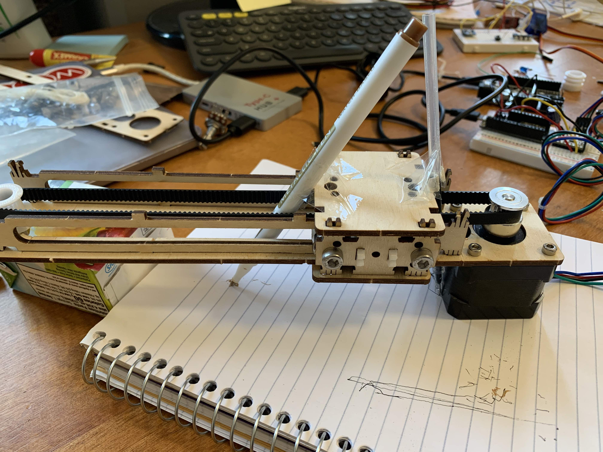

Stepper motors! I was stuck for a long time this week on what to do with them. On Thursday, however, after class I went to the
Isabella Stewart Gardner museum with a friend. They have a temporary exhibit showcasing Shen Wei's art, which is all about movement. In the 2008 Opening Ceremony of the Beijing Olympics, dancers with ink on the soles of their feet and palms of their hands painted a painting through dance. Shen Wei was the choreographer. 

I got inspired! I can't dance, so what if I mimicked Shen Wei's art with a stepper motor? 

This ended up being a lot harder than anticipated. First of all, I ran into a LOT of issues getting the pulley system to work. 

I got it all constructed during class. 

The fatal error is that I didn't test it with the motor that day (I went to the Isabella Stewart Gardner museum instead).

When I worked on it next over the weekend, I followed the [Wiring Tutorial](https://nathanmelenbrink.github.io/ps70/12_machine/steppers.html). The tutorial suggests using a wall outlet supply, but instead I used the 5V pin from the Metro board. I had a lot of trouble with the stepper motor wires since I needed 4 little wires to secure it to the pins of the DRV883 Driver. 

However, when I uploaded the code (see the bottom), the pulley system would just tremble and not move in the direction I wanted. 

Or, on a good day, it would move, but kind of get stuck for some reason.

After a lot of frustration and confusion, I decided to take it apart completely and test each part one by one. I'm now going to go through all my mistakes, but the tl;dr is that a lot of things were wrong.

First, I did not realize there were little screws in the silver piece that was attached the stepper motor. I used the smallest size Allen wrench to tighten that up. 

Next, I checked if the belt worked with only the 3D-printed piece. It did! 

After using sandpaper on the wooden rails and adding washers to the side with the 3D piece...it worked! 

Here's an alternate view.

Actually later, it was still hit or miss performance, and I realized super super late that it was because my wires weren't completely connected......rookie mistake.

At this point, I was almost ready. I got a few different colors of pens: one gel pen, one metallic pen, and one colorful pen. It was really hard to tape the pens to the little moving platform. I think if I were to do this again, I would figure out how to cut holes into the wood platform to insert the pens inside instead of using tape. 

Here's a shot of it in action. I changed up the pens, changed up the angles, but didn't think too hard in terms of what it was drawing. At this point, I also want to give a shoutout to the mini juicebox that acted as a stand for this project.

After several iterations, voila! Here is my masterpiece...a little bit lacking when compared to Shen Wei's works, but still art in my eyes.

If I were to improve on this, I would probably use both stepper motors, either to run two pens at the same time, or keep the one pen but be able to move the pen both on the x and y axises. I would have done that this week, but I ran out of time given how long it took me to get one pulley system working. I could definitely also repurpose this for something like Avi's highlighter machine, or use it to make actual art or writing!

See code used here: 
    
    #include <AccelStepper.h>

    const int stepPin = 13;  // blue
    const int dirPin = 12;   // orange

    // Define a stepper and the pins it will use
    AccelStepper stepper(1, stepPin, dirPin); // initialise accelstepper for a two wire board

    void setup()
    {
    }

    void loop()
    {
    if (stepper.distanceToGo() == 0)
    {
        // Random change to speed, position and acceleration
        // Make sure we dont get 0 speed or accelerations
        delay(1000);
        
        stepper.setMaxSpeed(500);
        stepper.setAcceleration(500);
        stepper.moveTo(1000);
    }
    stepper.run();
    if (stepper.distanceToGo() == 0)
    {
        // Random change to speed, position and acceleration
        // Make sure we dont get 0 speed or accelerations
        delay(1000);
        
        stepper.setMaxSpeed(500);
        stepper.setAcceleration(500);
        stepper.moveTo(-1000);
    }
    }

Final project: I didn't get to spend too much time on my final project this week, but it seems like using the ESP 32 camera provided in class and connecting that to Firebase, I can take photos and store them online. I could have some sort of button system that would be triggered by a dog's paw. The only piece that is left is thinking about how the treat dispenser will work. Nathan sent me a few links to past projects that use stepper motors to dispense which I think will be extremely relevant. In all, I think my project is very doable! Will definitely draw some sketches this week. 