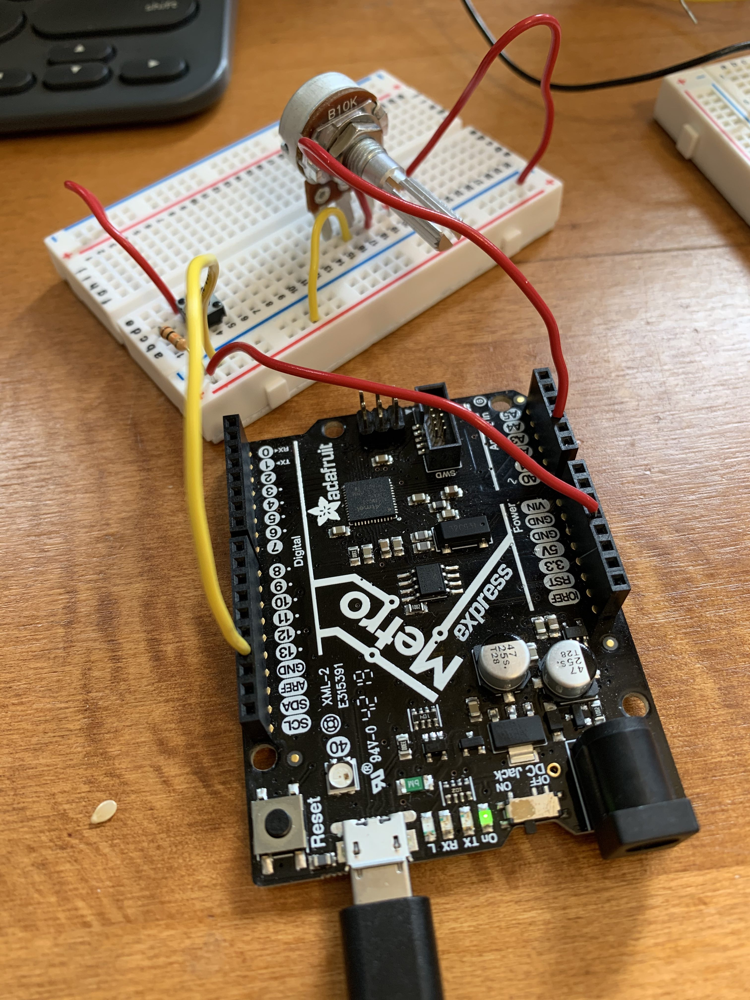
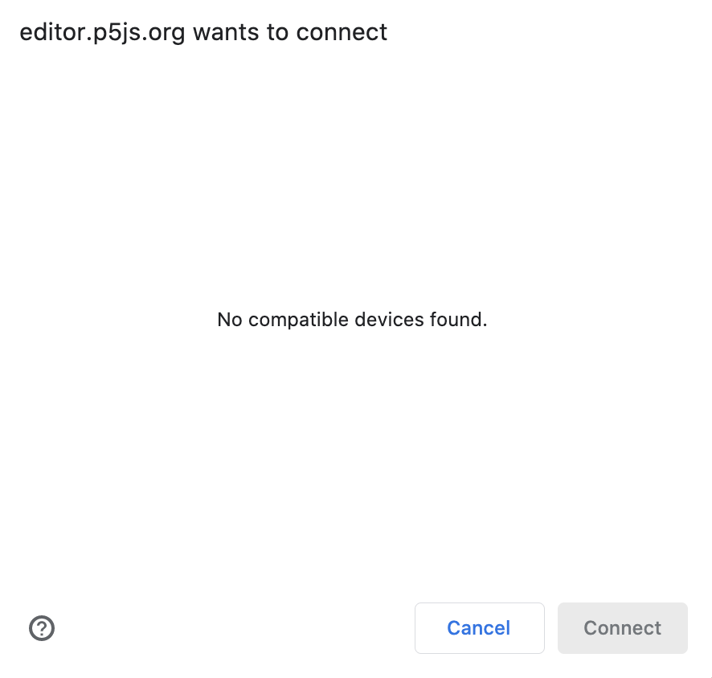

I had a lot of difficulty this week with different kinds of errors. 

#### OpenCV

I was able to connect the ESP32-cam with OpenCV to try computer vision, but my hotspot was so slow that the lag was too great to actually test it out. I think I might've run out of data this month, so I'll have to try it again next month. 

#### Nathan's code

Next, I tried the code that Nathan uploaded with P5. I decided to use a potentiometer as my input. 

This worked well! I used the code Nathan provided us [here](https://nathanmelenbrink.github.io/ps70/13_programming/p5-usb.html). I got the lines to show up. It was a bit confusing, though, to figure out whether my potentiometer was feeding in input, because I couldn't find any lines being printed on the serial monitor. 

#### TinySorter

In any case, I decided to try out the [Teachable Machine](https://experiments.withgoogle.com/tiny-sorter/view) from here. Following the instructions to download libraries and add JS files was easy, but when I got to the final step, I kept getting an error. 

For some reason, the Teachable Machine doesn't recognize Metro M0 express board? I tried the Huzzah, but that gave me an error during compilation. I'm not sure if this is something I did wrong. 

##### Going back to Nathan's code

At this point, I decided to go back to Nathan's code and just learn some more about P5. It took me a while to really understand the code. Afterwards, I decided to add some circles! You can't tell here, but I created them so that they bounce around. 

If I had more time, I would have added more interactivity between the circles and the line that the cursor/potentiometer draws. I sort of ran out of time though since it took me to long to get a grip on P5. I'll paste the code I ended up having at the bottom of the page here. 

##### Final Project Update:

I've decided to make a selfie photobooth...for dogs! I was inspired by a [Simone Giertz video](https://www.youtube.com/watch?v=rvG6V_BXsTE). She uses lot of Legos and takes apart a treat dispenser. The way I build my project will be different but hopefully with the same outcome. 

I'll be using the ESP-32 Cam to take the photos, which will be triggered by a button on the ground (pressed by the dog!). I'll upload the photos to Firebase for viewing :) Everytime the button is pressed, a treat will be dispensed. I'll be building it inspired by a [past student's project](https://wanyiwang0507.github.io/Wanyi-Wang-PHYS-S12/final/index.html) by using a motor to rotate --> dispense a treat.

At this point, I'm thinking about how to make the photobooth look cute instead of a bunch of wires and cams. Simone Giertz used Legos and a small curtain, but not sure what I will do yet!

Here's my code: 

  let path = [];
  let numPoints = 100;
  let numBalls = 13;
  let spring = 0.05;
  let gravity = 0.03;
  let friction = -0.9;
  let balls = [];

  function setup() {
    createCanvas(710, 400, WEBGL);

      camera(0, -100, width * 1.5, 0, 0, 0, 0, 1, 0);

      for (let i = 0; i < numPoints; i++ ) {
        path[i] = new p5.Vector(0, 0, 0);
      }
    for (let i = 0; i < numBalls; i++) {
      balls[i] = new Ball(
        random(width),
        random(height),
        random(30, 70),
        i,
        balls
      );
      }
      noStroke();
      fill(255, 204);

  }

  function draw() {
    background(0);
    orbitControl();

    drawGrid();
    drawAxis();
    drawPath(); 

    balls.forEach(ball => {
      ball.collide();
      ball.move();
      ball.display();
      });
  }

  function drawAxis() {
    let unit = 100;
    strokeWeight(5);
    //textSize(40);

    // x axis
    stroke(255, 0, 0);
    line(0, 0, 0, unit, 0, 0);
    fill(255, 0, 0);
    //text("X", unit + 5, 0, 0);

    // y axis
    stroke(0, 255, 0);
    line(0, 0, 0, 0, unit, 0);
    fill(0, 255, 0);
    //text("Y", 0, unit + 5, 0);

    // z axis
    stroke(0, 0, 255);
    line(0, 0, 0, 0, 0, unit);
    fill(0, 0, 255);
    //text("Z", 0, 0, unit + 5);
  }

  function drawGrid() {
    let cellSize = 50; 

    stroke(255);
    strokeWeight(1);

    for (let x = 0; x <= width; x += cellSize) {
      line(x, 0, x, height);
    }

    for (let y = 0; y <= height; y += cellSize) {
      line(0, y, width, y);
    }
  }

  function drawPath() {

    // Draw lines
    strokeWeight(3);
    for (let i = 0; i < numPoints - 1; i++) {
      let val = i / numPoints * 204.0 + 51;
        stroke(val);
      line(path[i].x, path[i].y, path[i].z, path[i+1].x, path[i+1].y, path[i+1].z);
      //circle(path[i].x, path[i].y, 5);
    }

    // Draw points
    // strokeWeight(12);
    // path.forEach(p=>{
    // 	point(p.x, p.y, p.z);
    // })
  }

  class Ball {
    constructor(xin, yin, din, idin, oin) {
      this.x = xin;
      this.y = yin;
      this.vx = 0;
      this.vy = 0;
      this.diameter = din;
      this.id = idin;
      this.others = oin;
    }

    collide() {
      for (let i = this.id + 1; i < numBalls; i++) {
      // console.log(others[i]);
      let dx = this.others[i].x - this.x;
      let dy = this.others[i].y - this.y;
      let distance = sqrt(dx * dx + dy * dy);
      let minDist = this.others[i].diameter / 2 + this.diameter / 2;
      //   console.log(distance);
      //console.log(minDist);
      if (distance < minDist) {
        //console.log("2");
        let angle = atan2(dy, dx);
        let targetX = this.x + cos(angle) * minDist;
        let targetY = this.y + sin(angle) * minDist;
        let ax = (targetX - this.others[i].x) * spring;
        let ay = (targetY - this.others[i].y) * spring;
        this.vx -= ax;
        this.vy -= ay;
        this.others[i].vx += ax;
        this.others[i].vy += ay;
      }
      }
    }

    move() {
      this.vy += gravity;
      this.x += this.vx;
      this.y += this.vy;
      if (this.x + this.diameter / 2 > width) {
      this.x = width - this.diameter / 2;
      this.vx *= friction;
      } else if (this.x - this.diameter / 2 < 0) {
      this.x = this.diameter / 2;
      this.vx *= friction;
      }
      if (this.y + this.diameter / 2 > height) {
      this.y = height - this.diameter / 2;
      this.vy *= friction;
      } else if (this.y - this.diameter / 2 < 0) {
      this.y = this.diameter / 2;
      this.vy *= friction;
      }
    }

    display() {
      ellipse(this.x, this.y, this.diameter, this.diameter);
    }
    }

  (function() {
    'use strict';

    document.addEventListener('DOMContentLoaded', event => {
      let connectButton = document.querySelector("#connect");
      let statusDisplay = document.querySelector('#status');
      let port;

      function isNumeric(value) {
        return /^\d+$/.test(value);
    }

      function connect() {
        port.connect().then(() => {
          statusDisplay.textContent = '';
          connectButton.textContent = 'Disconnect';

          console.log("connected");

          port.onReceive = data => {
            let textDecoder = new TextDecoder();
            let decodedData = parseInt(textDecoder.decode(data), 10);
            if (isNumeric(decodedData)){
        console.log(decodedData);
        // Shift all elements 1 place to the left
        for (let i=1; i < numPoints; i++ ) {
          path[i-1] = path[i];
        }

        // Add new point to the end of the array
        path[numPoints-1] = new p5.Vector(mouseX, mouseY, decodedData);
            }
          };

          port.onReceiveError = error => {
            console.error(error);
          };
        }, error => {
          statusDisplay.textContent = error;
        });
      }

      connectButton.addEventListener('click', function() {
        if (port) {
          port.disconnect();
          connectButton.textContent = 'Connect';
          statusDisplay.textContent = '';
          port = null;
        } else {
          serial.requestPort().then(selectedPort => {
            port = selectedPort;
            connect();
          }).catch(error => {
            statusDisplay.textContent = error;
          });
        }
      });

      serial.getPorts().then(ports => {
        if (ports.length === 0) {
          statusDisplay.textContent = 'No device found.';
        } else {
          statusDisplay.textContent = 'Connecting...';
          port = ports[0];
          connect();
        }
      });

    });
  })();
