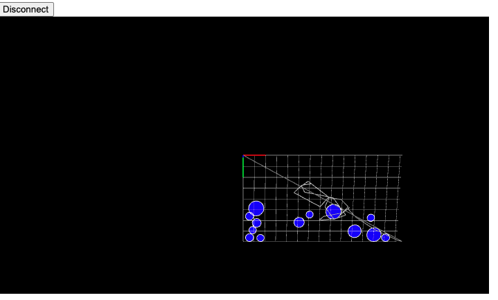

I had a lot of difficulty this week with different kinds of errors. 

#### OpenCV

I was able to connect the ESP32-cam with OpenCV to try computer vision, but my hotspot was so slow that the lag was too great to actually test it out. I think I might've run out of data this month, so I'll have to try it again next month. 

#### Nathan's code

Next, I tried the code that Nathan uploaded with P5. I decided to use a potentiometer as my input. 

This worked well! I used the code Nathan provided us [here](https://nathanmelenbrink.github.io/ps70/13_programming/p5-usb.html). I got the lines to show up. It was a bit confusing, though, to figure out whether my potentiometer was feeding in input, because I couldn't find any lines being printed on the serial monitor. 

#### TinySorter

In any case, I decided to try out the [Teachable Machine](https://experiments.withgoogle.com/tiny-sorter/view) from here. Following the instructions to download libraries and add JS files was easy, but when I got to the final step, I kept getting an error. 

For some reason, the Teachable Machine doesn't recognize Metro M0 express board? I tried the Huzzah, but that gave me an error during compilation. I'm not sure if this is something I did wrong. 

##### Going back to Nathan's code

At this point, I decided to go back to Nathan's code and just learn some more about P5. It took me a while to really understand the code. Afterwards, I decided to add some circles! 

If I had more time, I would have added more interactivity between the circles and the line that the cursor/potentiometer draws. I sort of ran out of time though since it took me to long to get a grip on P5. 

##### Final Project Update:

I've decided to make a selfie photobooth...for dogs! I was inspired by a [Simone Giertz video](https://www.youtube.com/watch?v=rvG6V_BXsTE). She uses lot of Legos and takes apart a treat dispenser. The way I build my project will be different but hopefully with the same outcome. 

I'll be using the ESP-32 Cam to take the photos, which will be triggered by a button on the ground (pressed by the dog!). I'll upload the photos to Firebase for viewing :) Everytime the button is pressed, a treat will be dispensed. I'll be building it inspired by a [past student's project](https://wanyiwang0507.github.io/Wanyi-Wang-PHYS-S12/final/index.html) by using a motor to rotate --> dispense a treat.

At this point, I'm thinking about how to make the photobooth look cute instead of a bunch of wires and cams. Simone Giertz used Legos and a small curtain, but not sure what I will do yet!