This week was a lot of fun! I felt like I was embracing a younger version of myself. It was really difficult finding objects that would fit the needs of the assignment given the constraints of my dorm room, but I settled on these two objects: a small cat eraser and a hippo keychain. 

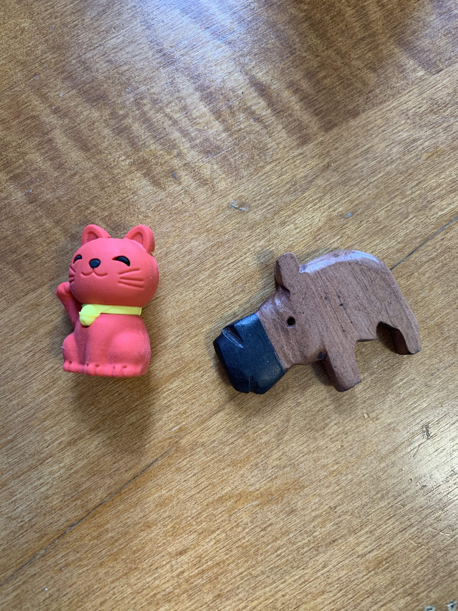

For the cat, I was worried about the fact that it had some crevices (it's one of those japanese erasers that you can pull apart). For the sake of science, I decided to go ahead and try it since I was fairly certain the hippo would work. 

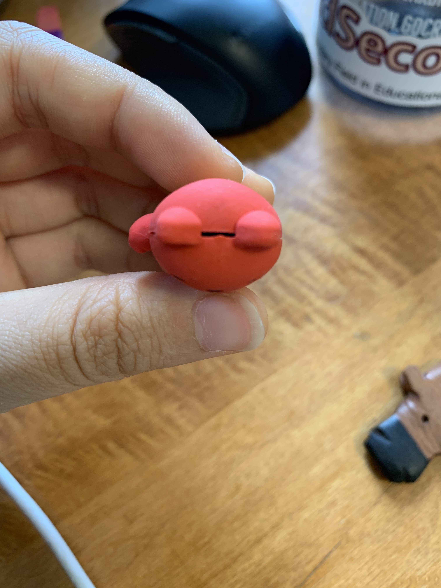

Like how Nathan dunked the pagoda in the silicone mixture, I stuck a skewer in the cat.
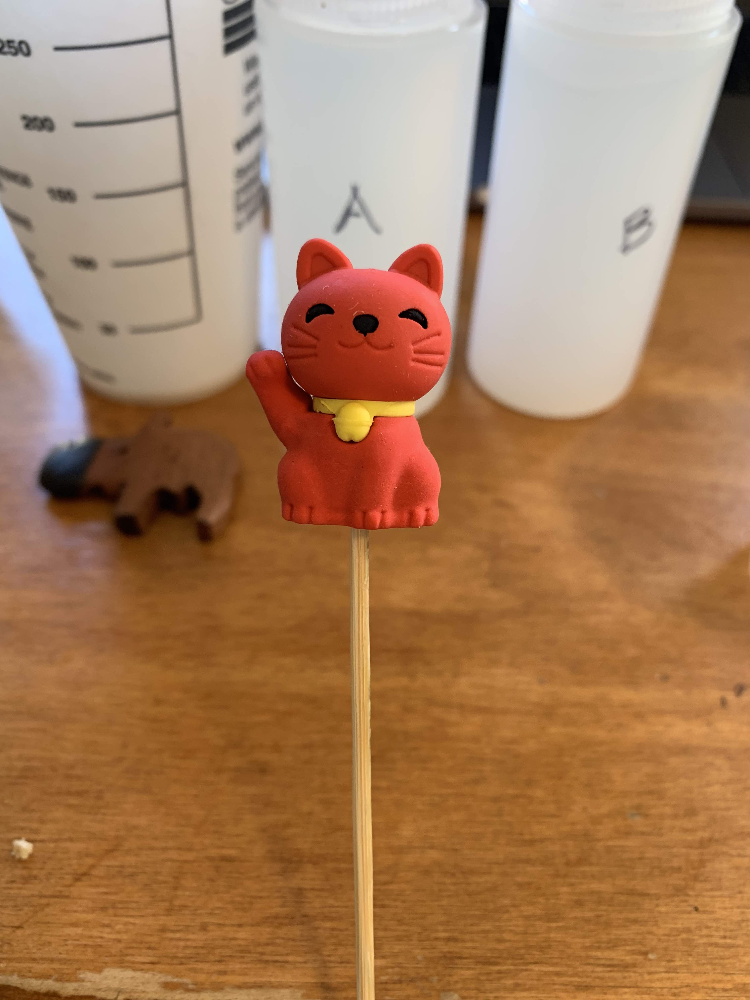

I used both the plastic cages given to us as well as these little IMC paper cups I had. The IMC Cup has a slightly larger diameter which was useful for the hippo. The plastic cup was slightly taller, and just tall enough for the red cat. 

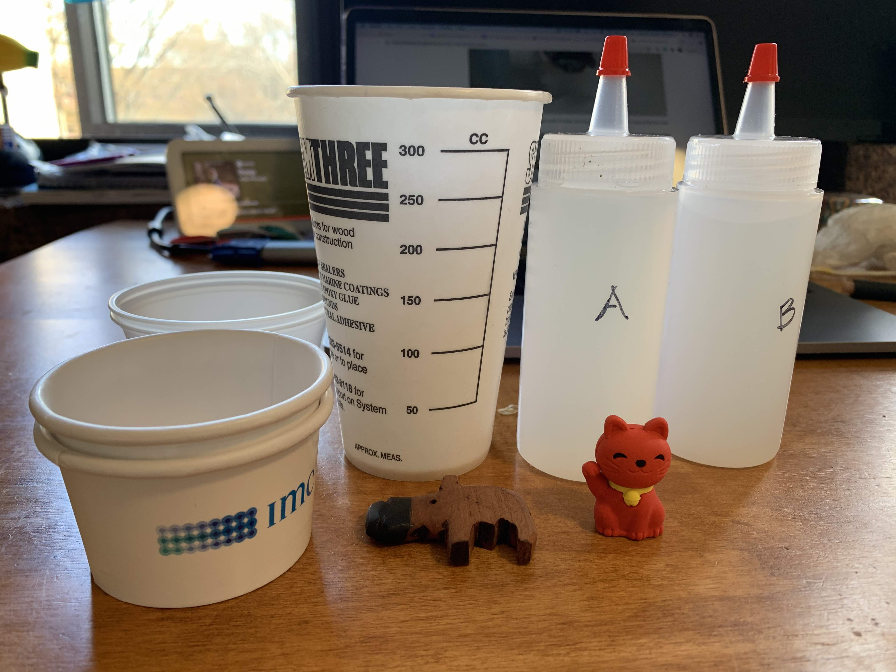

I first poured in about 2 ounces of mixture B and then added Mixture A. I tried to avoid air bubbles, but you can tell from this photo that there were still a lot of air bubbles. I'm not sure how to improve on this for next time because I poured it just like the way Nathan did in lab. I think one potential improvement would be to directly pour Mixture A into the container that holds Mixture B?

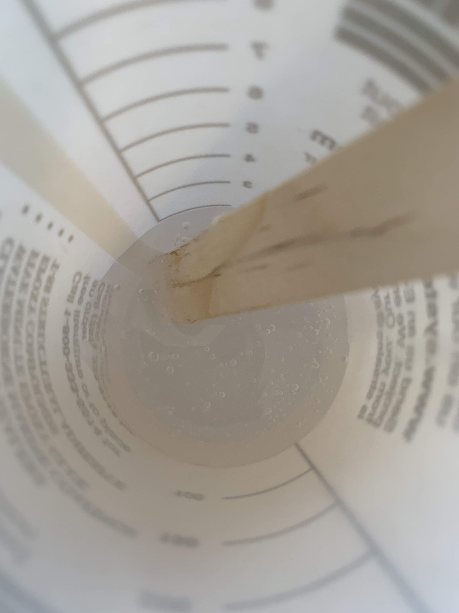

Using half of the mixtures given to us was just enough for my two molds. For the hippo, I pressed it just enough to expose the top face but still be submerged in the mixture. I got lucky that the hippo didn't sink! 
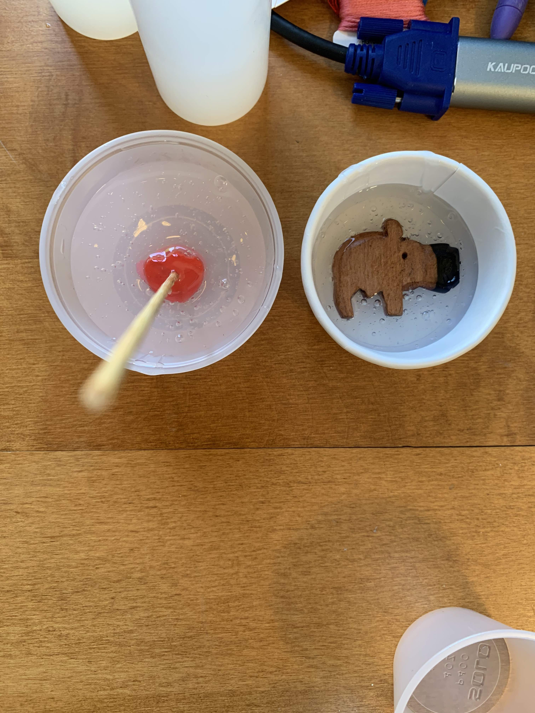

As for the red cat, it became clear that it needed extra support since it kept leaning over. I did some taping with the popsicle sticks to make this makeshift structure that would hold the skewer in place. 

Since there were so many air bubbles, I used the pointy end of the skewer to pop air bubbles that were on the surface of the mold or close to the object. This was actually really effective, although of course I wasn't able to pop bubbles deeper inside the mixture. To do that, I'd probably need to construct a vent of some kind.

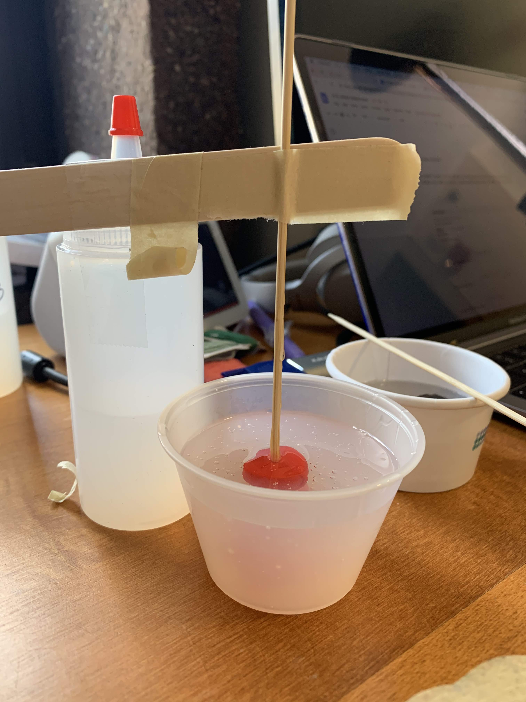

I noticed the silicone hardening after 5-6 hours, but I decided to leave it overnight anyway. The next morning, voila! It was really easy to pop out the hippo. The mold managed to get the eye of the hippo too. 
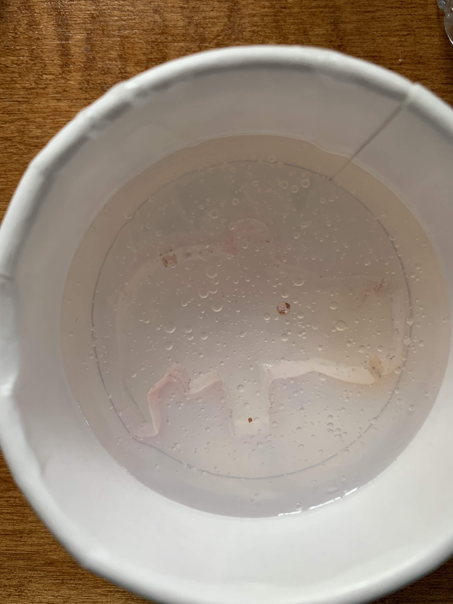

However, the red cat was less successful. I spent about 30 minutes trying to get the cat out of the mold. First I used scissors to cut around the excess silicone. The problem with the cat mold is that the head is larger than the body. Looking back, I probably should have reversed the direction that I put the cat in. The other problem is that because the eraser was made of multiple parts, it was difficult to take the entire eraser out in one go. 

In the end, after cutting some slits on the side and even involving my roommate, we couldn't get the last part out. I might try again another day. 
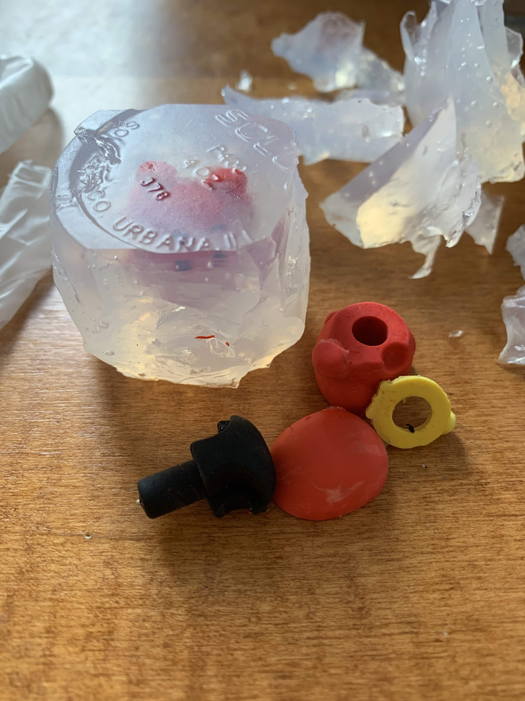
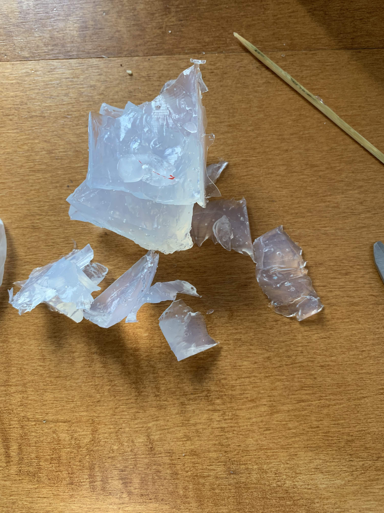

I don't know why, but I had leftover food coloring! Using my hippo mold, I made a frozen blue hippo. 
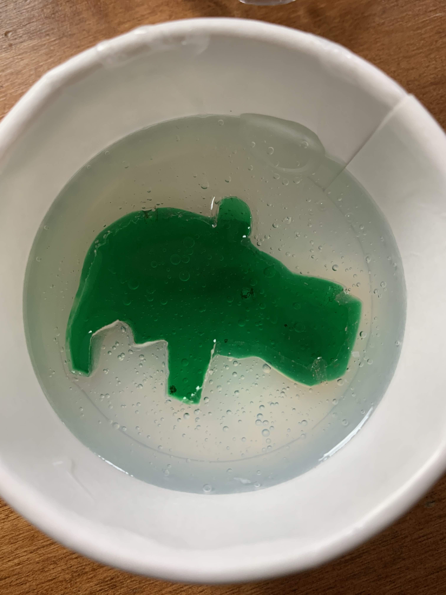

It was pretty cool that the frozen hippo could stand up too. Twinning!
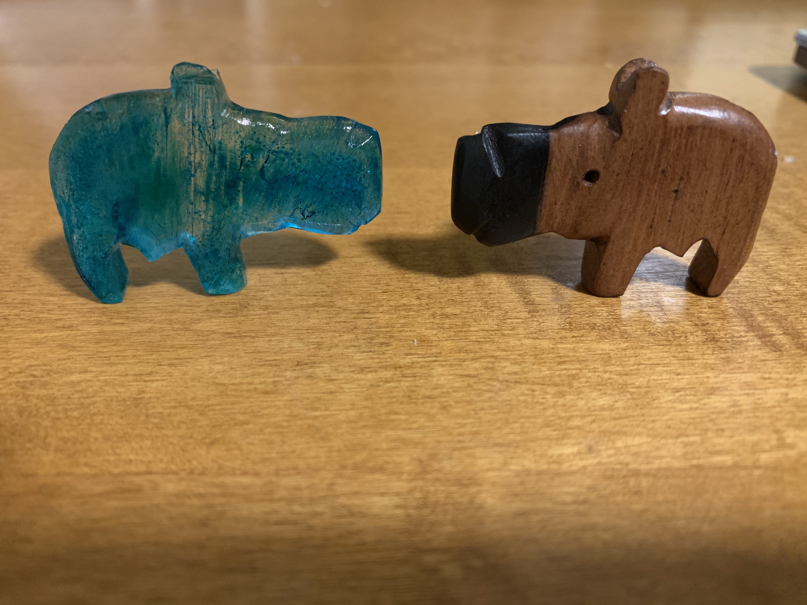
