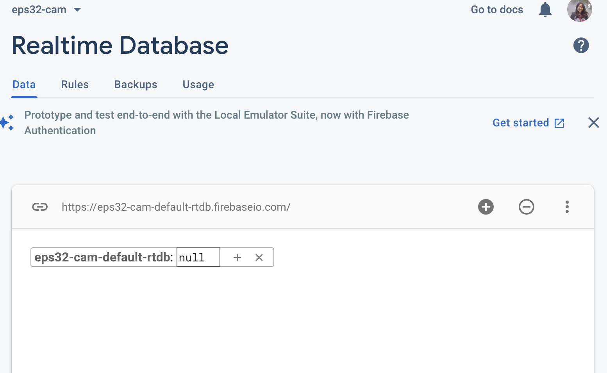
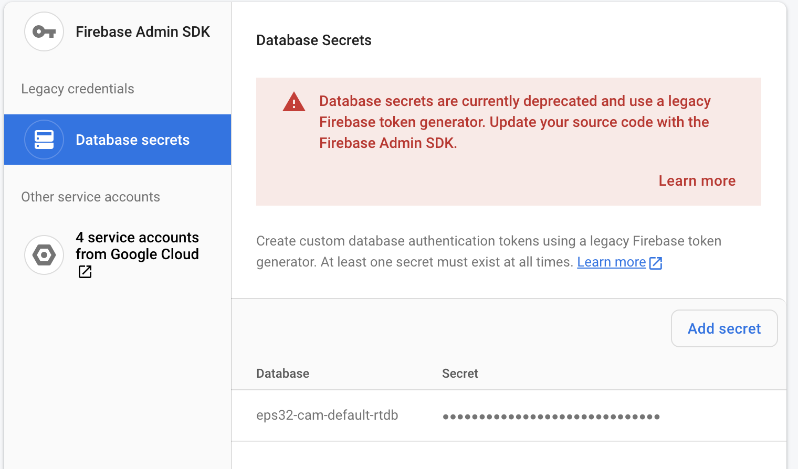
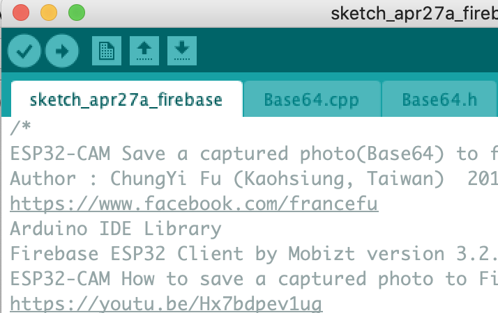
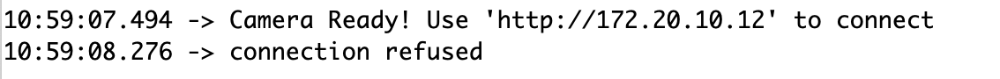

This week I checked in with Nathan and Sean about my final project. I was mainly unsure how to construct the overall look of the project, and Nathan suggested I use a poster board (like those 3rd grade tri-fold posters). Nathan also suggested creating a slide of some kind to make the treat dispenser fun! Originally I was thinking of using a button mechanism, but thinking about how dogs learn new tricks and adjust to new environments, some kind of pressure sensor or capacitative sensor might be easier. Another "nice to have" goal would be to construct a pan-tilt kit so that the camera could tilt!

The main part that I need to figure out for my project is exporting or saving photos from the EPS-32 cam to Firebase. I know that Jessica had a bit of difficulty with this a couple weeks ago, but I decided to follow the same [tutorial](https://www.youtube.com/watch?v=Hx7bdpev1ug&ab_channel=fuchungyi) and try it out myself. 

The files that the tutorial uses are [here](https://github.com/fustyles/Arduino/tree/master/ESP32-CAM_Firebase). Initially, I got the same error as Jessica mentions in her documentation, how she is unable to create a secret key. To overcome this issue, I created a database like we did for the [Huzzah project](https://nathanmelenbrink.github.io/ps70/10_networking/huzzah1b.html), and this seemed to do the trick. 

Now that I had this secret key, I copy and pasted it in the Arduino file, which were found in the links above. I was still running into a compiler error, but turns out this was a common error (many of the Youtube video comments mentioned). The author of the video recommends downloading the 3.2.1 version of the [Firebase EPS library](https://www.arduinolibraries.info/libraries/firebase-esp32-client). After adding the ZIP library to Arduino, all compiler errors were gone! Yay!

The problem, though, is that even when successfully uploading to my EPS-32 cam, I would get "connection refused". I couldn't figure out this error, even when combing through the Youtube video comments. I don't think it's the Wifi connection issue, so I'm not too sure what's up. I do think I am close though...

I did a quick Google search and it seems like there are other methods of exporting photos. For example, there does seem to be documentation on using [AWS S3](https://docs.aws.amazon.com/freertos/latest/userguide/getting_started_espressif.html) instead of Google's Firebase. There's also apparently a method that uses [email](https://www.instructables.com/ESP32-CAM-Capture-Photos-and-Send-Through-E-mail-U/)!

I'm hopeful that I will figure out *something* in the next week to get this to work!

Plan for the rest of the project

This week: Figure out the Firebase/ESP-32 Cam, purchase posterboard and dog treats
Next week: 3D design the "slide" of the treat dispenser, figure out the basic mechanism of the treat dispenser and pressure sensor
Last week: Work on the aesthetics of the project, improve project and reliability, train dog!
