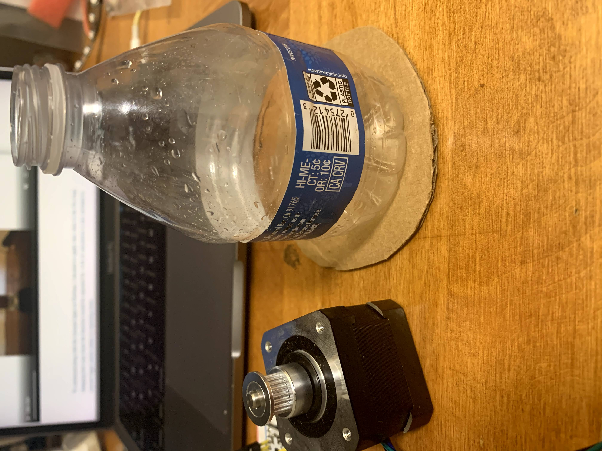
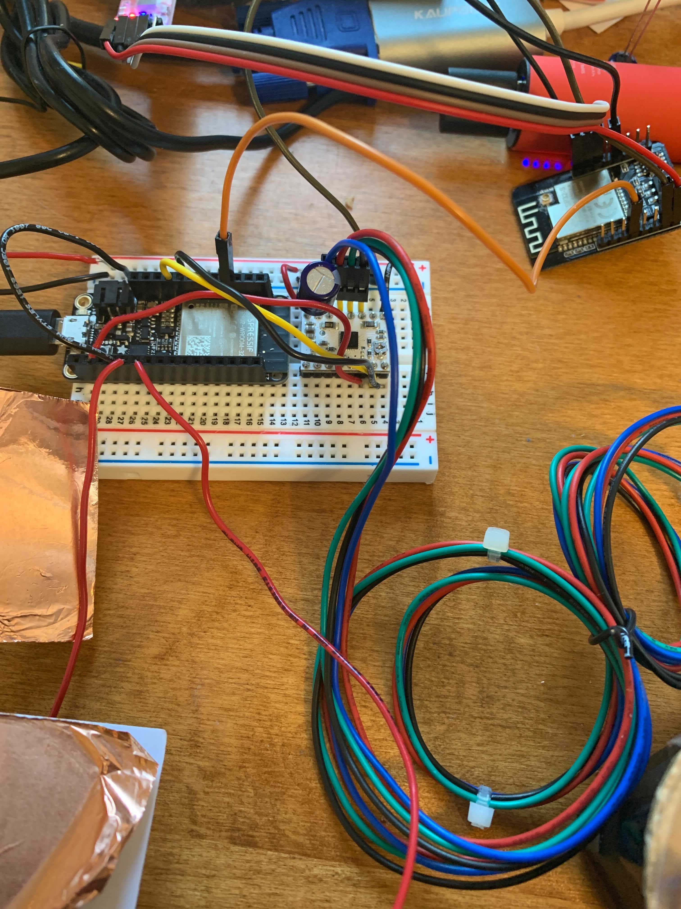

# A Selfie Booth...for Dogs.

## [Demo Video](https://www.youtube.com/watch?v=fJeeHrSD2aU&ab_channel=AmyZhou)

## Project Motivation

I got this brilliant idea from a [Simone Giertz](https://www.youtube.com/watch?v=rvG6V_BXsTE&ab_channel=SimoneGiertz) video where she creates a selfie booth for her dog using Legos. As a dog owner myself, I was excited at this possibility, because I take sooo many photos of my dog. All dogs are so cute, always! Thinking about the skills we learned in this class, I realized that recreating Simone Giertz's idea was completely doable using the supplies and materials we had been supplied with. With that, I embarked on this journey.

## Materials

- Trifold posterboard
- Assorted cardboard
- AI ESP32 camera
- Adafruit Huzzah Feather
- Copper capacitative sensors
- Stepper motor
- Small water bottle
- Dog treats
- Portable battery charger
- Wall outlet power supply

## Project Process

My project uses the AI ESP-32 camera, an Adafruit Huzzah Feather, copper capacitative sensors, and a stepper motor to create a selfie booth for dogs. Using the capacitative sensors, dogs can press the sensor with their paw or nose. This triggers a photo getting taken from the camera and a treat getting dispensed from the treat dispenser. 

My first iteration of this project was to teach a dog to press a button, which would trigger both a photo being taken and a treat being dispensed from the treat dispenser. However, as Nathan pointed out, it might be difficult to convince a dog to press a small button on a breadboard, both of which are unfamiliar to the dog. Thus, I changed my design to include capacitative sensors which would be more familiar as they are flat and on the ground. 

### Camera & Firebase

This portion of the project by far took the longest time compared to other components. The most important part of my project was ensuring that photos could be taken using the camera and stored on the database. I chose to use Firebase as a realtime, online database because it was convenient, reliable, and compatible with the ESP-32 camera. I followed this [tutorial](https://www.youtube.com/watch?v=Hx7bdpev1ug&ab_channel=fuchungyi) which seemed to be helpful for many, according to the comments. Unfortunately, I ran into errors pretty early on the process in an earlier week. The most frustrating error was "connection refused", a very vague error from the Firebase library calls. 

I tried isolating the problem -- was it the fact that I had a Mac? I tried it on my friend's PC computer. Was it the fact that I was using a hotspot instead of a wifi network? I tried it at my friend's place who was off campus. Neither of these solved the issue. "Connection refused" remained. It was very confusing because Nathan was able to push photos to my database and his database, using identical code. In the end, Erik was super helpful and figured out it was a [library version issue](https://github.com/mobizt/Firebase-ESP32/issues/35). Although the video recommends using the Firebase library version 3.2.1, this link above shows that you can update the latest version of the library as long as you change a few lines of code of how the photos are uploaded.  Thus, the part of the code that originally read

    String jsonData = "{\"photo\":\"" + Photo2Base64() + "\"}";
    String photoPath = "/esp32-cam";
    if (Firebase.pushJSON(firebaseData, photoPath, jsonData)) {
        Serial.println(firebaseData.dataPath());
        Serial.println(firebaseData.pushName());
        Serial.println(firebaseData.dataPath() + "/"+ firebaseData.pushName());
    } else {
        Serial.println(firebaseData.errorReason());
    }

instead read

    FirebaseJson json;
    json.setJsonData("{\"photo\":\"" + Photo2Base64() + "\"}");
    String photoPath = "/esp32-cam";
    if (Firebase.pushJSON(firebaseData, photoPath, json)) {
        Serial.println(firebaseData.dataPath());
        Serial.println(firebaseData.pushName());
        Serial.println(firebaseData.dataPath() + "/" + firebaseData.pushName());
    } else {
        Serial.println(firebaseData.errorReason());
    }

The entire code file can be found at the bottom of this documentation. Thank you Erik, Nathan, and Sean!

From here, I was able to take photos with my camera. On the Firebase database, I was able to extract the photos taken. 

To view the photo, you just have to copy/paste the "data:image..." full address, removing the quotes from the beginning and end. 

### Treat Dispenser

After I figured out the Firebase database with the camera, I was able to move on to constructing the treat dispenser. I got inspired by a [past student's project](https://wanyiwang0507.github.io/Wanyi-Wang-PHYS-S12/final/index.html) which was a cat food dispenser. 

I wired up the stepper motor as below, connecting it to my Huzzah board.

I installed the little motor brackets for better control over the wheel I would attach onto the motor. I didn't have time to 3D anything for the treat dispenser unfortunately, so instead I cut out a small cardboard wheel and used a small plastic water bottle I had lying around. 

For the cardboard cutout, I cut a hole in the middle to stick to the motor bracket, and then another hole for the treat to dispense out of. 

At the end, I had a wheel that I could attach the treat dispenser that would rotate on command!

### Capacitative Sensors

The capacitative sensors were pretty simple to wire together. I decided to place the capacitative sensors on the Huzzard board with the stepper motor. This way, the capacitative sensors could directly trigger the stepper motor movements. I just used two pins for the capacitative sensors on the Huzzard board. See the code and wiring below for more information!

### Wiring Everything Together

Here's a photo of my final wiring:

I connected the Huzzah to an external battery pack, the stepper motor to a wall outlet, and the ESP-32 camera to my laptop. It was best to connect my camera to my laptop, because then I could read the serial monitor and more easily debug if anything went wrong. 

At this point, my missing piece was connecting the capacitative sensor to the camera. If a dog presses the sensor, a photo should be taken. My initial idea was to try using serial to connect the Huzzah to the camera. Victoria helped me a lot with this! For serial, [this link](https://roberthart56.github.io/SCFAB/SC_lab/Networking/networking/USART/index.html) was really helpful. However, I found that for reason, when I applied serial to my camera and Huzzah, I kept getting a Memory dump error. 

    12:59:45.114 -> Guru Meditation Error: Core  1 panic'ed (IllegalInstruction). Exception was unhandled.
    12:59:45.114 -> Memory dump at 0x400e78e0: 77644677 57fe77e6 e4dee665   

On the serial monitor, my camera would continually reboot itself. The issue was just the camera, there was no issue on the Huzzah. 

After talking to Nathan, I realized I was overcomplicating things and could instead just use digital I/O, since I only needed a HIGH or LOW signal, binary value, to indicate whether I wanted to take a photo not. In the wiring above, the orange wire is what connected the Huzzah and the CAM. I had a lot of trouble getting the digital I/O portion to work. Because there were so many components, it got a bit difficult to troubleshoot. The most rookie mistake I made is that I accidentally was looking at the WRONG pinout diagram for the Huzzah (there are two Adafruit Huzzahs, but only one is ESP-32). Due to this, I was using the wrong pin number the entire time. To debug the digital I/O, I also used a voltmeter to measure the differences in voltage in the two pins (comparing it to ground as well). 

In the end, by using the correct pin numbers, with digital I/O, I was able to use the capacitative sensors to switch the value from LOW to HIGH, and thus trigger an image being taken. 

I picked up a trifold poster board from Blick's and bought some "pup-peroni" from Target. 

Since I knew my testing dog was small, I cut up the poster board. I cut a hole to insert the camera, and rearranged everything as best I could. I ended up taping down the capacitative sensors. I used this time to test the camera angle. After that photo was taken, I did some simple decorations, because well...I wasn't really sure how to decorate it. 

## Testing

To test my project, I had a special guest....my tutor's new puppy, Donkey! 

Donkey was completely a wildcard -- I had him for a limited amount of time and had no idea how fast he'd be able to learn how to press the capacitative sensors. Hint: it would take much longer than expected. Also it would involve Donkey peeing on my yoga mat. 

Since Donkey was so excitable as a puppy, it was nearly impossible to get his eyes off the treat dispenser. As a result, using him as a test subject, I had to remove the treat dispenser from view. In addition, I really had to motivate him with a treat to press the sensors, since he didn't really understand the trick. 

I realized from this that either the sensor has be placed far away from the camera, or there needs to be a delay between pressing the button and taking the photo. Unfortunately, I wasn't able to have Donkey for long enough to teach him the trick. Perhaps an older dog less excited by treats would be better suited!!

## Some of the resulting photos!

## Limitations

The greatest limitation in this project was time. My final projects in other classes were poorly timed with this one, and so I didn't end up with as much time as I would have liked on this project. Furthermore, figuring out Firebase took much longer than I expected -- this created a personal mental block that prevented me from moving on to other aspects of the project. In hindsight, I should have started on the other components earlier. 

The fact that the sensor directly takes a photo without any delay meant that a lot of the photos were just of the dog's body, not its face. Also, the plastic bottle of the treats was just too alluring for Donkey, perhaps a stronger, more invincible treat dispenser would be better suited. 

## Future Improvements

There's definitely a lot of room for improvement here. Following from the limitations above, more time to alter and tweak both the placement and angle of the camera would ensure better photos. Likewise, altering the placement of the capacitative sensors and including potential delays to time the photos better would be helpful. 

For the camera, I could have used stepper motors to allow for camera height adjustment depending on the size of the dog. 

With more time, I would have changed the cardboard and treat dispenser pieces to be 3D printed, as a more permanent and cleaner solution. 

Lastly, I would have loved to spend more time on the decoration portion of the project! Simone Giertz did a fantastic job decorating her dog selfie booth with a red curtain and an exterior Lego encasing. Given the time, I would have loved to paint or decorate the exterior more. 

## Code:

Here's all of the code used in this project!

The code uploaded to the CAM:

    /*
    ESP32-CAM Save a captured photo(Base64) to firebase. 
    Author : ChungYi Fu (Kaohsiung, Taiwan)  2019-8-16 23:00
    https://www.facebook.com/francefu
    Arduino IDE Library
    Firebase ESP32 Client by Mobizt version 3.2.1
    ESP32-CAM How to save a captured photo to Firebase
    https://youtu.be/Hx7bdpev1ug
    How to set up Firebase
    https://iotdesignpro.com/projects/iot-controlled-led-using-firebase-database-and-esp32
    */

    // REPLACE these credentials with yours!!
    const char* ssid = "";
    const char* password = "";

    //https://console.firebase.google.com/project/xxxxxxxxxx/settings/serviceaccounts/databasesecrets
    // REPLACE these credentials with yours!!
    String FIREBASE_HOST = "";
    String FIREBASE_AUTH = "";

    #include "FirebaseESP32.h"
    FirebaseData firebaseData;

    #include <WiFi.h>
    #include "soc/soc.h"
    #include "soc/rtc_cntl_reg.h"
    #include "Base64.h"

    #include "esp_camera.h"

    // WARNING!!! Make sure that you have either selected ESP32 Wrover Module,
    //            or another board which has PSRAM enabled   

    //CAMERA_MODEL_AI_THINKER
    #define PWDN_GPIO_NUM     32
    #define RESET_GPIO_NUM    -1
    #define XCLK_GPIO_NUM      0
    #define SIOD_GPIO_NUM     26
    #define SIOC_GPIO_NUM     27

    #define Y9_GPIO_NUM       35
    #define Y8_GPIO_NUM       34
    #define Y7_GPIO_NUM       39
    #define Y6_GPIO_NUM       36
    #define Y5_GPIO_NUM       21
    #define Y4_GPIO_NUM       19
    #define Y3_GPIO_NUM       18
    #define Y2_GPIO_NUM        5
    #define VSYNC_GPIO_NUM    25
    #define HREF_GPIO_NUM     23
    #define PCLK_GPIO_NUM     22

    void setup() { 
    WRITE_PERI_REG(RTC_CNTL_BROWN_OUT_REG, 0);
    pinMode(14,OUTPUT);      //Pin 4 provides the voltage step
    pinMode(15, INPUT_PULLUP);
    Serial.begin(9600);
    Serial.setDebugOutput(true);
    Serial.println();
    Serial.println("ssid: " + (String)ssid);
    Serial.println("password: " + (String)password);
    WiFi.begin(ssid, password);

    long int StartTime=millis();
    while (WiFi.status() != WL_CONNECTED) {
        delay(500);
        if ((StartTime+10000) < millis()) break;
    } 

    if (WiFi.status() == WL_CONNECTED) {
        char* apssid = "ESP32-CAM";
        char* appassword = "12345678";         //AP password require at least 8 characters.
        Serial.println(""); 
        Serial.print("Camera Ready! Use 'http://");
        Serial.print(WiFi.localIP());
        Serial.println("' to connect");
        WiFi.softAP((WiFi.localIP().toString()+"_"+(String)apssid).c_str(), appassword);            
    }
    else {
        Serial.println("Connection failed");
        return;
    } 

    camera_config_t config;
    config.ledc_channel = LEDC_CHANNEL_0;
    config.ledc_timer = LEDC_TIMER_0;
    config.pin_d0 = Y2_GPIO_NUM;
    config.pin_d1 = Y3_GPIO_NUM;
    config.pin_d2 = Y4_GPIO_NUM;
    config.pin_d3 = Y5_GPIO_NUM;
    config.pin_d4 = Y6_GPIO_NUM;
    config.pin_d5 = Y7_GPIO_NUM;
    config.pin_d6 = Y8_GPIO_NUM;
    config.pin_d7 = Y9_GPIO_NUM;
    config.pin_xclk = XCLK_GPIO_NUM;
    config.pin_pclk = PCLK_GPIO_NUM;
    config.pin_vsync = VSYNC_GPIO_NUM;
    config.pin_href = HREF_GPIO_NUM;
    config.pin_sscb_sda = SIOD_GPIO_NUM;
    config.pin_sscb_scl = SIOC_GPIO_NUM;
    config.pin_pwdn = PWDN_GPIO_NUM;
    config.pin_reset = RESET_GPIO_NUM;
    config.xclk_freq_hz = 20000000;
    config.pixel_format = PIXFORMAT_JPEG;
    //init with high specs to pre-allocate larger buffers
    if(psramFound()){
        config.frame_size = FRAMESIZE_UXGA;
        config.jpeg_quality = 10;  //0-63 lower number means higher quality
        config.fb_count = 2;
    } else {
        config.frame_size = FRAMESIZE_SVGA;
        config.jpeg_quality = 12;  //0-63 lower number means higher quality
        config.fb_count = 1;
    }
    
    // camera init
    esp_err_t err = esp_camera_init(&config);
    if (err != ESP_OK) {
        Serial.printf("Camera init failed with error 0x%x", err);
        delay(1000);
        ESP.restart();
    }

    //drop down frame size for higher initial frame rate
    sensor_t * s = esp_camera_sensor_get();
    s->set_framesize(s, FRAMESIZE_QQVGA);  // VGA|CIF|QVGA|HQVGA|QQVGA   ( UXGA? SXGA? XGA? SVGA? )
    
    Firebase.begin(FIREBASE_HOST, FIREBASE_AUTH);
    Firebase.reconnectWiFi(true);
    Firebase.setMaxRetry(firebaseData, 3);
    Firebase.setMaxErrorQueue(firebaseData, 30); 
    Firebase.enableClassicRequest(firebaseData, true);
    }
    
    void loop() { 
    Serial.println(digitalRead(15));
    if (digitalRead(15) == LOW) {
        FirebaseJson json;
        json.setJsonData("{\"photo\":\"" + Photo2Base64() + "\"}");
        String photoPath = "/esp32-cam";
            if (Firebase.pushJSON(firebaseData, photoPath, json)) {
                Serial.println(firebaseData.dataPath());
                Serial.println(firebaseData.pushName());
                Serial.println(firebaseData.dataPath() + "/" + firebaseData.pushName());
            } else {
                Serial.println(firebaseData.errorReason());
            }
        delay(5000);
    }

    }

    String Photo2Base64() {
        camera_fb_t * fb = NULL;
        fb = esp_camera_fb_get();  
        if(!fb) {
        Serial.println("Camera capture failed");
        return "";
        }
    
        String imageFile = "data:image/jpeg;base64,";
        char *input = (char *)fb->buf;
        char output[base64_enc_len(3)];
        for (int i=0;i<fb->len;i++) {
        base64_encode(output, (input++), 3);
        if (i%3==0) imageFile += urlencode(String(output));
        }

        esp_camera_fb_return(fb);
        
        return imageFile;
    }

    //https://github.com/zenmanenergy/ESP8266-Arduino-Examples/
    String urlencode(String str)
    {
        String encodedString="";
        char c;
        char code0;
        char code1;
        char code2;
        for (int i =0; i < str.length(); i++){
        c=str.charAt(i);
        if (c == ' '){
            encodedString+= '+';
        } else if (isalnum(c)){
            encodedString+=c;
        } else{
            code1=(c & 0xf)+'0';
            if ((c & 0xf) >9){
                code1=(c & 0xf) - 10 + 'A';
            }
            c=(c>>4)&0xf;
            code0=c+'0';
            if (c > 9){
                code0=c - 10 + 'A';
            }
            code2='\0';
            encodedString+='%';
            encodedString+=code0;
            encodedString+=code1;
            //encodedString+=code2;
        }
        yield();
        }
        return encodedString;
    }

The code uploaded to the Huzzah:

    #include <AccelStepper.h>

    const int stepPin = 13;  // blue
    const int dirPin = 12;   // orange

    int read_high;
    int read_low;
    int diff;

    // Define a stepper and the pins it will use
    AccelStepper stepper(1, stepPin, dirPin); // initialise accelstepper for a two wire board

    void setup() {
    pinMode(32,OUTPUT);      // Pin 32 provides the voltage step
    pinMode(A1,OUTPUT);

    Serial.begin(115200);

    stepper.setMaxSpeed(500);
    stepper.setAcceleration(500);

    }

    void loop()
    {
    digitalWrite(A1,HIGH);              //Step the voltage high on conductor 1.
    read_high = analogRead(A0);        //Measure response of conductor 2.
    delayMicroseconds(100);            //Delay to reach steady state.
    digitalWrite(A1,LOW);               //Step the voltage to zero on conductor 1.
    read_low = analogRead(A0);         //Measure response of conductor 2.
    diff = read_high - read_low;       //desired answer is the difference between high and low.

    Serial.println(diff);

    if (diff > 4000) {
        digitalWrite(32,LOW);
        if (stepper.distanceToGo() == 0)
        {
            delay(1000);
            stepper.setMaxSpeed(500);
            stepper.setAcceleration(500);
            stepper.moveTo(1000);
            digitalWrite(32,HIGH);
        }
        stepper.run();
        
    }
    
    }
