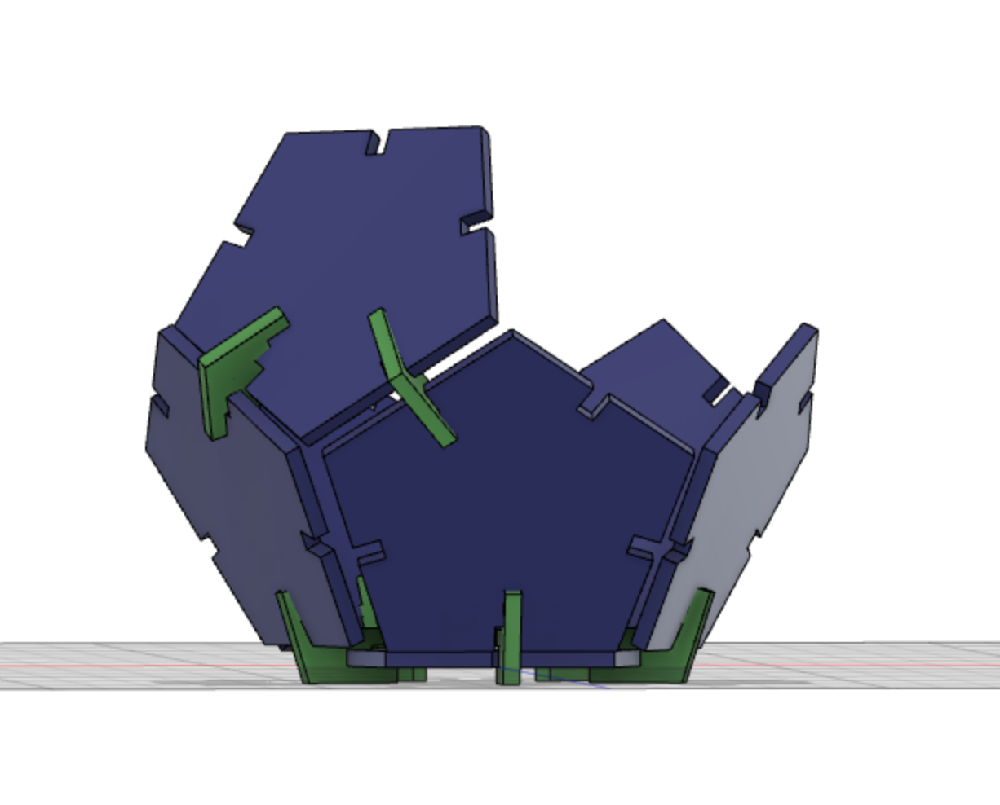
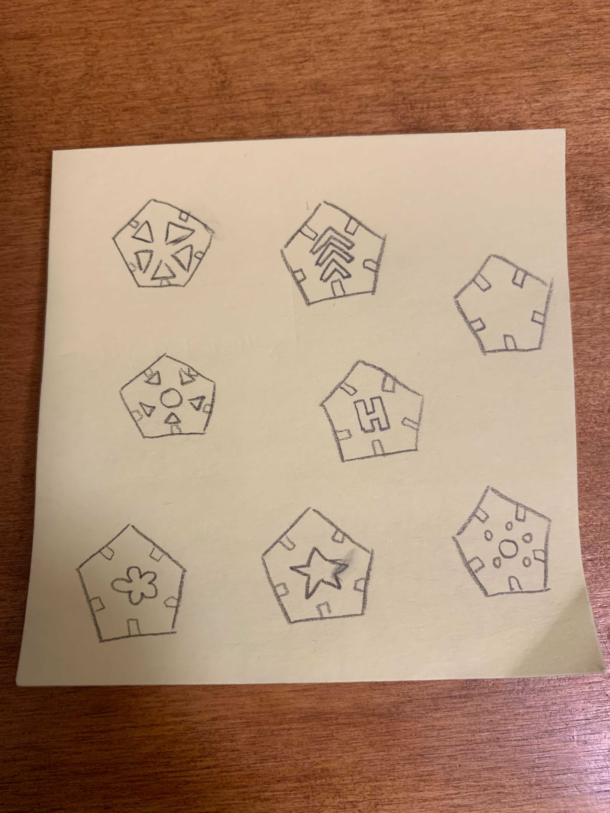
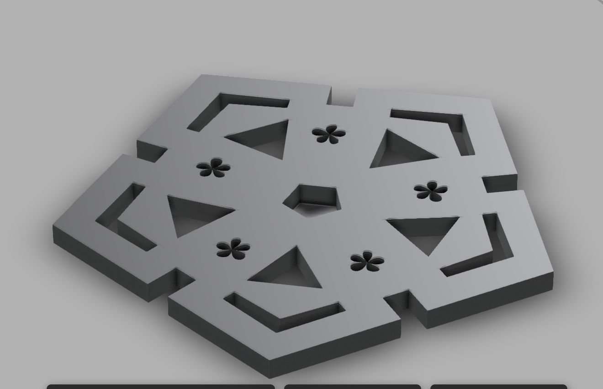
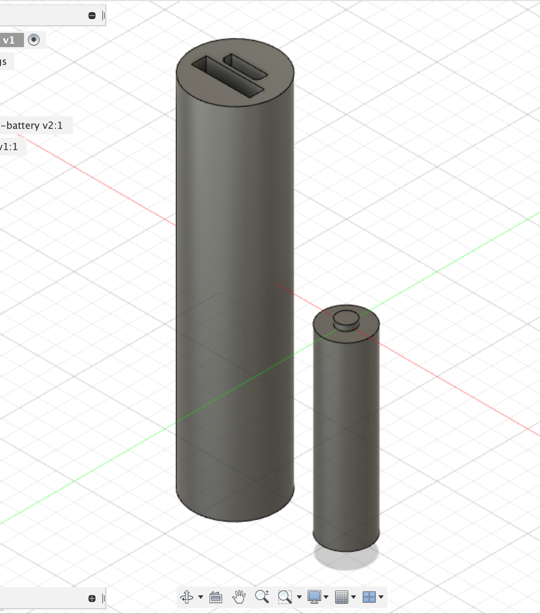
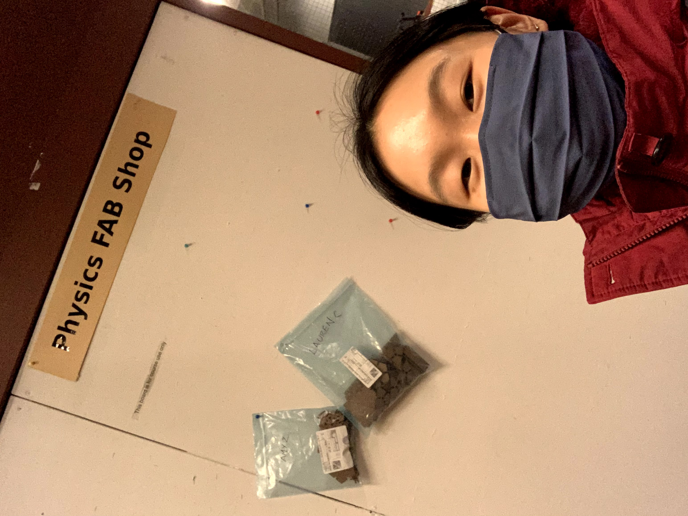
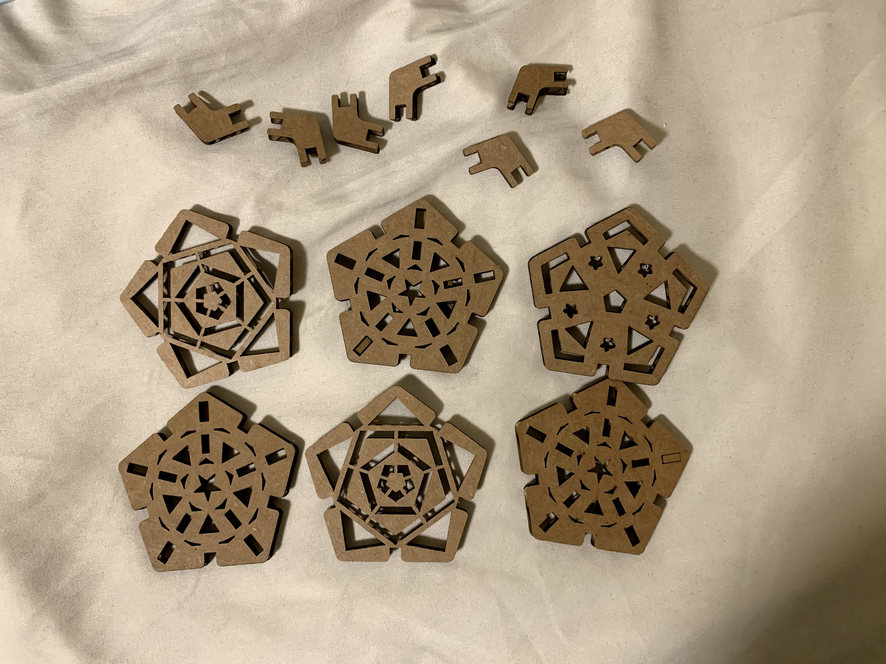
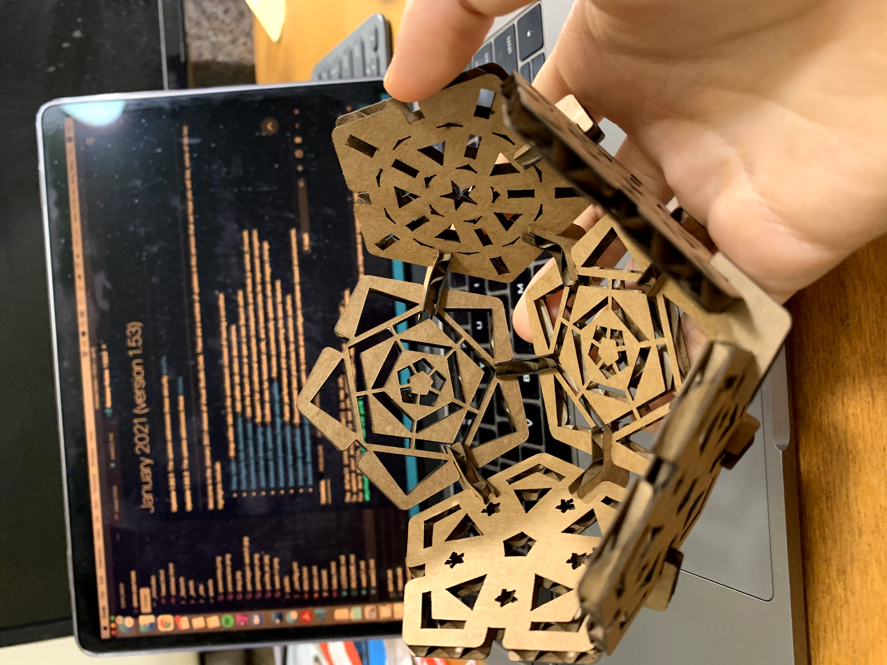

This week, I worked with JuHye & Hugh to design our cardboard cutouts. JuHye had the great idea of designing a lightbox! 

We decided to go with a pentagon shape with a small connector piece that would allow us to create a 3D box. 

What to do with the pentagon design? This was the fun part! 

Each of us decided to create our own -- I first started with some simple sketches by hand. 

Afterwards, I tried it out on Fusion. I started with the arrows, reminiscient of snowflakes, since it was snowing while I created this! Moving into the center of the pentagon, I went for geometric shapes like triangles and a center pentagon. At this point, I still felt like there was empty space and wanted to add more. I thought creating a flower shape would be nice, and after Googling, I used the splicing tool to do so. Thank goodness for the mirroring tool. If you look closely, the petals of the flowers are uneven, but I almost think it's more unique this way.

After our design was complete, I moved to the next step of modeling kit items in Fusion 360 to create an assembly. I chose two battery-related objects. One is the red acellories portable battery and the other is a standard AA battery. There's probably a way to add colors in Fusion 360 but I didn't figure that out for this week. I also wasn't sure how to create the little wristband that the portable battery comes with. Without further ado...here is the finished assembly. At first, I thought my caliper was broken because it wasn't turning on -- then I realized I never put in the battery it came with!

After a couple of weeks, I picked up the laser cutouts from the Fab lab in the Science center and assembled it at home. 

I tried to follow the original sketch that Hugh made in creating the physical model. The notches mostly fit together, but sometimes required me to bend/flex the notches to soften them up beforehand. Since each pentagon has five connecting points, it was difficult at times to fit everything together. 

The biggest flaw of our design is that we didn't leave a space to insert a light source. In the end, I decided to keep it half-constructed so I could shine a light through it like a half dome. 

Next time, I would have designed a base that has a hole in it. I actually couldn't take a video of the end result, because only my phone's flashlight was strong enough to show a pattern on my wall. The current design has a laser cut pattern on all of the sides, but I think that "dilutes" the light source and so the end pattern is not that dramatic. Overall, it was a really cool project that really showed me the power of Fusion360 3D design --> real life!