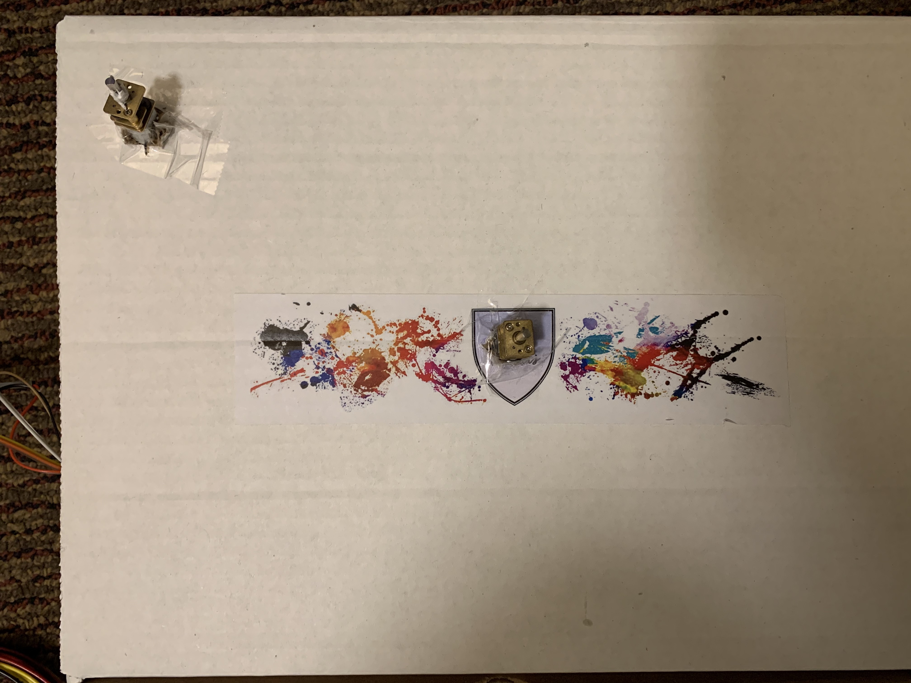
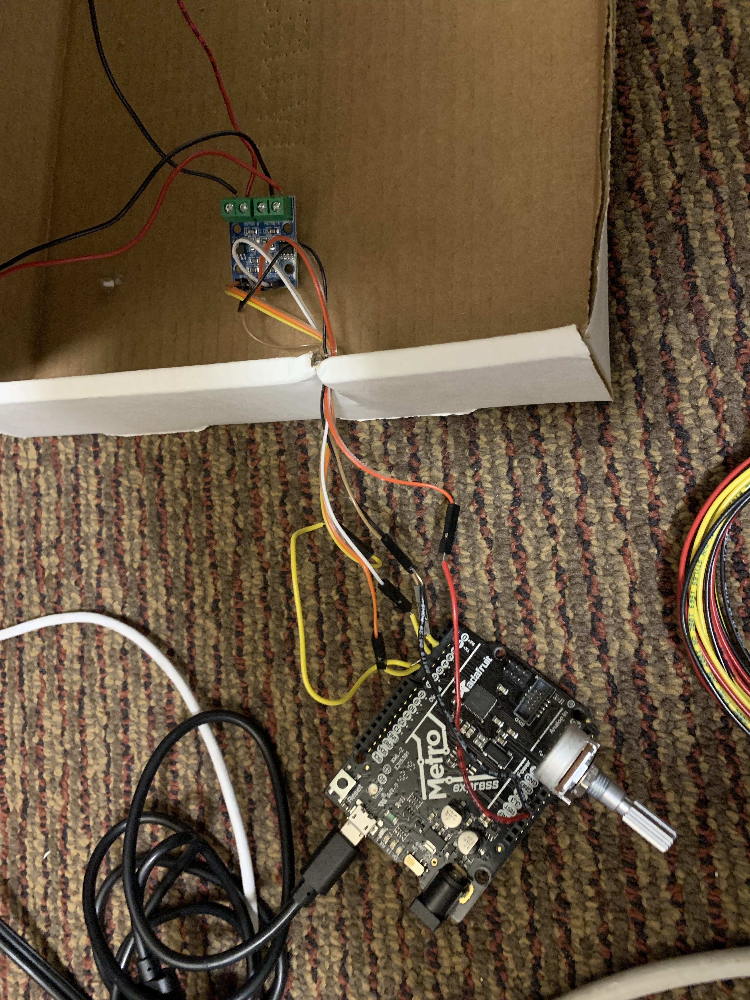

This week, I decided to do a continuation of my kinetic sculpture from last week. 

Since I also have kangaroos besides koalas, I decided to install a second motor in my sculpture and incorporate the kangaroos. Continuing on with the playground theme, I bent the rest of my clothes hanger into my favorite playground toy growing up (I forget what it's called!). I used the lego piece because it gave the kangaroo a platform to sit on, and I used an abundance of tape and poster gum to stick everything together.

I poked another hole in the box to install the second motor, making sure the two structures wouldn't collide when I installed them.

I used Pins 5 and 6, adding that to my code and associating them to B1A and B1B. Used my screwdriver to screw the wires in. I found that the speeds were all too fast for my structures, so I lowered to it to speeds around 30. Once I got my Metro board set up, I was ready to go! (Code snippet below)

I didn't get to play around with it as much as I wanted because I somehow broke Pin 5 (I think my wire broke in half and fell in?) late Monday night. It's bit difficult to see in the photo.

My koala merry-go-around from last week fell apart, and so after reconstruction and a minor cut to my thumb, some troubleshooting with stability, I set it all up for a spin.

As you can see, the koala structure was pretty wobbly. I stabilized it with some poster gum and reconstructed the triangle to make the weights more even. 

Here's the final product:

If I hadn't broken the Metro board and had more time, I would have liked to explore more complicated mechanisms of the sculpture and using better timing the motors to be able to do something more advanced. However, this week definitely familiarized myself with the way to export code to the Metro board!

Final code:

    const int A1A = 3;  // define pin 3 for A-1A (PWM Speed)
    const int A1B = 4;  // define pin 4 for A-1B (direction)
    const int B1A = 5;  // define pin 5 for B-1A (PWM Speed)
    const int B1B = 6;  // define pin 6 for B-1B (direction)

    void setup() {
    pinMode(A1A, OUTPUT);     // specify these pins as outputs
    pinMode(A1B, OUTPUT);
    pinMode(B1A, OUTPUT);    
    pinMode(B1B, OUTPUT);
    digitalWrite(A1A, LOW);   // start with the motors off 
    digitalWrite(A1B, LOW);
    digitalWrite(B1A, LOW);  
    digitalWrite(B1B, LOW);
    }

    void loop() {
    // start the motor at a medium speed
    analogWrite(A1A, 15);   
    digitalWrite(A1B, LOW);
    analogWrite(B1A, 15);   
    digitalWrite(B1B, LOW);
    delay(4000);              // allow the motor to run for 4 seconds

    // stop the motor
    analogWrite(A1A, 0);   // setting both pins LOW stops the motor
    digitalWrite(A1B, LOW);
    analogWrite(B1A, 0);   // setting both pins LOW stops the motor
    digitalWrite(B1B, LOW);
    delay(2000);              // keep the motor off for 2 seconds

    // start the motor in opposite direction and faster
    analogWrite(A1A, 30);  
    digitalWrite(A1B, HIGH);  // switch direction
    analogWrite(B1A, 30);  
    digitalWrite(B1B, HIGH);  // switch direction
    delay(4000);              // allow the motor to run for 4 seconds

    // stop the motor
    analogWrite(A1A, 0);   // setting both pins LOW stops the motor
    digitalWrite(A1B, LOW);
    analogWrite(B1A, 0);   // setting both pins LOW stops the motor
    digitalWrite(B1B, LOW);
    delay(2000);   

    }