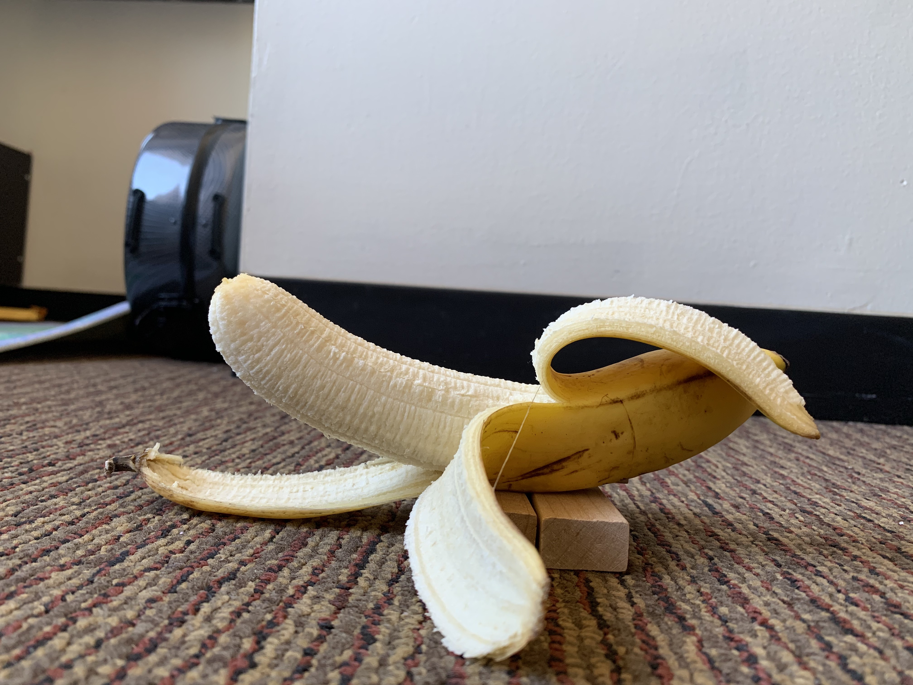
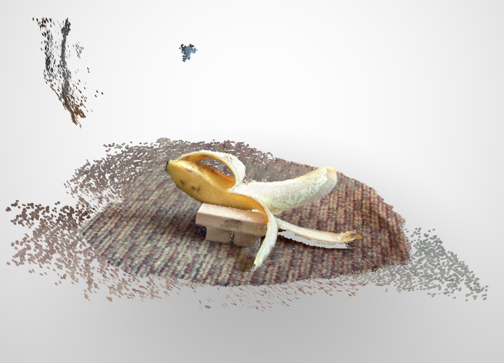
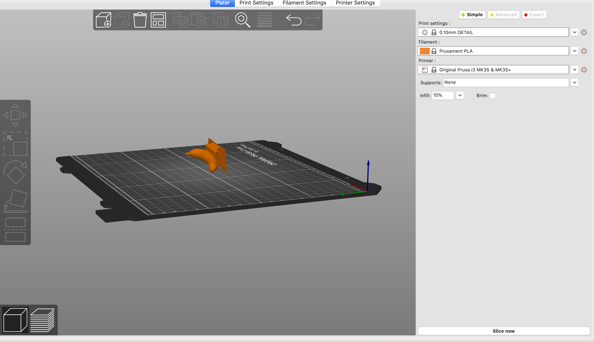
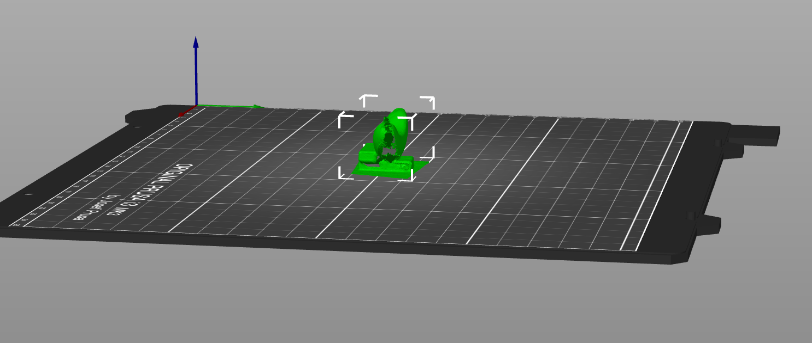

This week I played around with 3D scanning apps and PrusaSlicer. I tried the apps ScandyPro, Qlone, and Capture. Qlone ended up requiring a payment, so I tried both ScandyPro and Capture. Since I have an iPhone XR, and not an iPhone 12 Pro, I had to rely on my front facing camera for true depth sensing. This proved to be a little difficult to get an even scan of my object, especially since I didn't have anything to rotate my banana on.

I knew I wanted to print a banana, because my blockmate's 3D printed banana broke last year (I can't remember how it got broken). I figured I would use this opportunity to gift him a new one. I got a couple bananas from the dining hall and chose the best looking one as my model. I couldn't get the banana to stand on its own, so I used a few Jenga blocks to support it. 

Here's my attempt! This one is using the ScandyPro app. It was incredibly difficult to scan the banana with the front facing camera. I kept accidentally getting my knees and hair into the scan, and I also kept scanning too fast, so that I would end up with a banana mutant looking thing.

I decided afterwards to try it with the banana skin peeled, since this is in theory more worthwhile to use 3D printing technology. 

For this, I used the Capture app. The scanning method was the same as ScandyPro. However, it exports in a .usdz file format, which I could not figure out how to convert to .stl. I finagled with this for a long time, and I figured out there was an online portal that I could connect my app to that would allow me to download the file in a .obj format. Even still, the .obj file was too large to convert to .stl using web browser conversion methods. 

Here's what it looked like though:

I played around a bit in PrusaSlicer but wasn't able to do too much, not sure how to patch the gaping hole in my banana?

I figured no matter how much I improved the scan, it still wouldn't look as cool as this...

You can find the file <a href="https://github.com/azhou4/ps70/blob/main/assets/stl/BananaKnightV2.stl"> here</a>!

You're welcome Caleb and thank you Thingiverse!