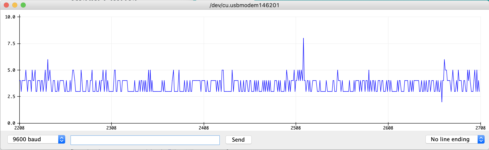
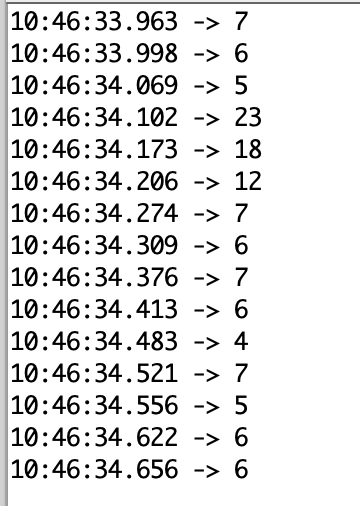
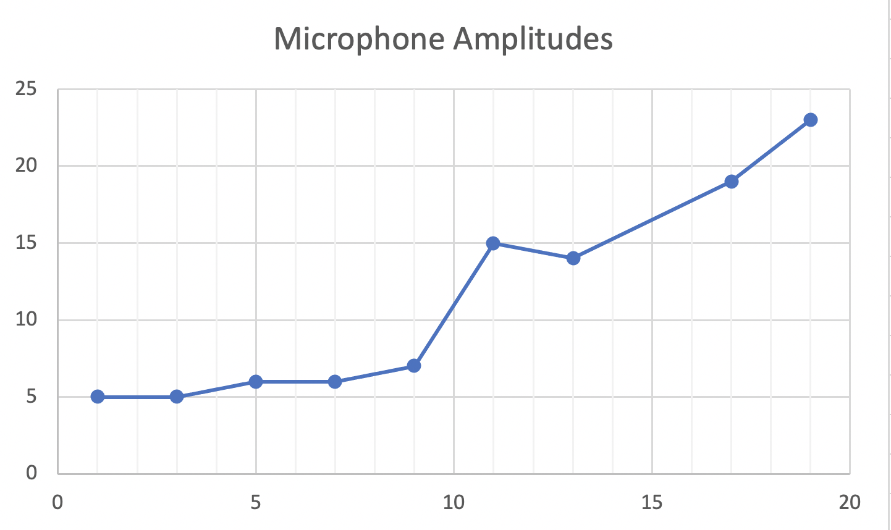
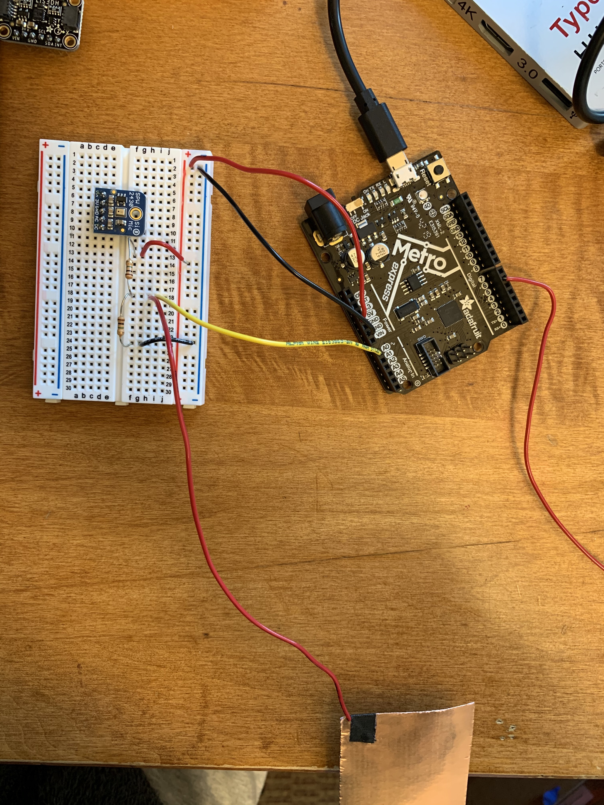
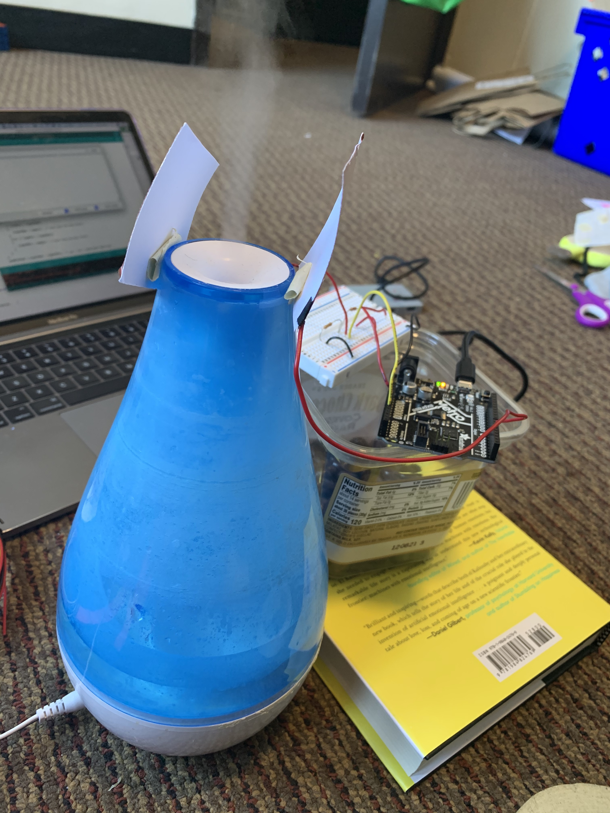
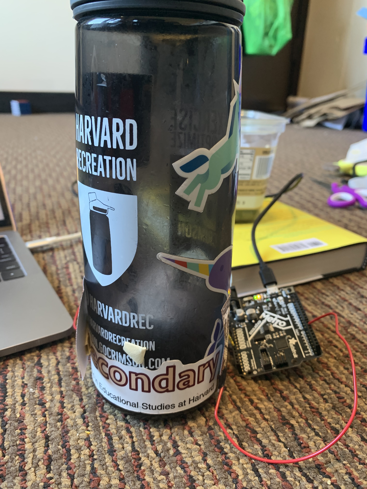

This week I learned how to use capacitator sensors and the microphone! I started with the microphone. I followed the instructions on the website -- pretty easy to follow! 

I figured out the monitor graph and was able to blow into the microphone to see peaks in the graph.

Since I needed some kind of control in order to calibrate, I wasn't sure what sounds to play. Then it hit me. I could use the volume levels on my phone to play a song. The control or zero would be no music, and then I decided to increase the volume by two button presses each time. So obviously I chose a Taylor Swift song. 

While doing this though, I found that it was actually pretty difficult to estimate the levels on the graph so I changed back to using the monitor. I used the following methodology: I would play the first 30 seconds of the same Taylor Swift song and record the highest number shown on the monitor. I added in timestamps to make it easier to track.

This method resulted in this graph! The x-axis is the volume on my phone, and the y-axis is the number displayed on the monitor. It's definitely not linear, and the anomaly around the middle makes me think multiple trials would have been good. I think in the future, I definitely would want to try this out on something with a wider range of volumes, maybe a speaker or something like that.

Next, I built a capacitative sensor, using the method discussed in class. I racked my brain and yet could not think of anything creative for this assignment. 

I tried to see humidity would do anything using my humidifier, but either I did it wrong, or the sensors were not sensitive enough to detect a difference.

So I ended up doing the exact one that Nathan showed in class! I'm looking forward to see what others did to give me some ideas to try.

