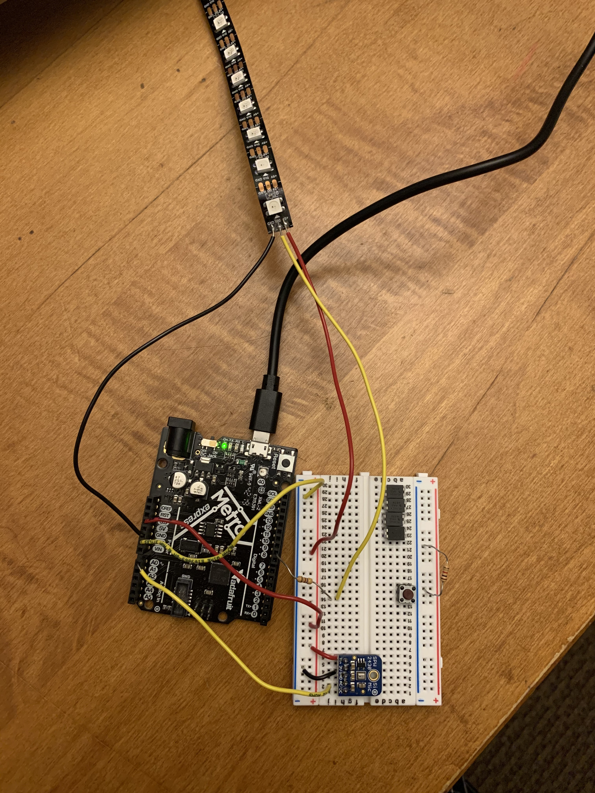

I've been inspired by everyone else's LED strip projects -- since I haven't worked with any LEDs yet, I decided this week to try out an LED strip as my output. Last week, I learned how to use the microphone -- why not combine the two? First, I set up the microphone just like I did last week.

My idea was to build an LED strip that visualizes music. When music is played, it would light up corresponding to the loudness of the music. The louder it was, the more LEDs would light up. Obviously this is not a new idea, many people had done this already. I Googled around a bit to see how others had connected the microphone with the LED strip and tried to copy their solutions. But in the end, none of those worked. I actually spent an unfortunate amount of time on this -- after getting unnecessarily frustrated over this, I decided to create the code myself. To do this, I decided to build the microphone and LED components separately, get them to work, then combine the code myself.

First, I set up the microphone. Although I set it up just like last week, I had some issues with the microphone this time. The data was very noisy, and it didn't seem like it was able to pick up differences between when I was talking, when I was playing music, or silence. Sometimes I felt like it did, but I couldn't tell if it was just confirmation bias or whether the microphone is pretty inconsistent. 

Next it was LED time. I wasn't too confident with the LED strip yet, especially with what to do with the Din wire. Instead, I built the LED part with just a plain LED instead of the whole LED strip first. By tapping the microphone, you can see that the blue LED shows a response! So good so far.

Next, I replaced the blue LED with the LED strip. This took more time than expected, I had to change around some pins and really understand what was going on before it worked. A lot of Googling was done here.

After figuring it out eventually, I uploaded the example code for the LED strip, which increments green lights through a for loop. Yay, this part worked pretty smoothly!

Now, it got to the tricky part of combining microphone with the LED strip. Specifically, I needed to make sure that the microphone levels would translate into meaningful changes to the number of LED lights that displayed. At this point, I had two sketch files (one for the microphone, one for the LED strip), and I literally mish-mashed together. Then, I moved things around and just debugged. 

The biggest issue is that my microphone didn't seem to pick up on sounds. I could increase the Serial Monitor/Plot levels by tapping the microphone, but it didn't show discernible differences with music. Hoping to debug this in a future lab! But in any case, I added some if conditions to check the sound peaks, and assign a specific case of how many lights should light up. It kind of worked with clapping!

Code here: 
    #include <Adafruit_NeoPixel.h>

    #define PIN        9 
    #define NUMPIXELS 10 
    #define DELAYVAL 50 // Time (in milliseconds) to pause between pixels
    const int sampleWindow = 50; // Sample window width in mS (50 mS = 20Hz)
        unsigned int sample;
        
    Adafruit_NeoPixel strip(NUMPIXELS, PIN, NEO_GRB + NEO_KHZ800);
    long previousMillis = 0; 
    void setup() {
    Serial.begin(9600);
    strip.begin(); // INITIALIZE NeoPixel strip object (REQUIRED)
    strip.show();            // Turn OFF all pixels ASAP
    strip.setBrightness(10); // Set BRIGHTNESS low to reduce draw (max = 255)
    }

    void loop() {
    strip.fill(strip.Color(0, 0, 0), 0);
    strip.show();
    strip.clear(); // Set all pixel colors to 'off'
    unsigned long startMillis= millis();  // Start of sample window
        unsigned int peakToPeak = 0;   // peak-to-peak level

        unsigned int signalMax = 0;
        unsigned int signalMin = 1024;
        

    // collect data for 50 mS
    while (millis() - startMillis < sampleWindow)
    {
        sample = analogRead(0);   //reading DC pin from pin A0
        if (sample < 1024)  // toss out spurious readings
        {
            if (sample > signalMax)
            {
                signalMax = sample;  // save just the max levels
            }
            else if (sample < signalMin)
            {
                signalMin = sample;  // save just the min levels
            }
        }
    }
    peakToPeak = signalMax - signalMin;  // max - min = peak-peak amplitude

    Serial.println(peakToPeak);
    if (peakToPeak > 60 and peakToPeak < 80) 
    {
        strip.fill(strip.Color(0, 150, 0), 0, 1);
    } else if (peakToPeak >= 50 and peakToPeak < 60){
            strip.fill(strip.Color(0, 150, 0), 0, 2);
    } else if (peakToPeak >= 60 and peakToPeak < 70){
            strip.fill(strip.Color(0, 150, 0), 0, 3);
    } else if (peakToPeak >= 70 and peakToPeak < 80){
            strip.fill(strip.Color(0, 150, 0), 0, 4);
    } else if (peakToPeak >= 80 and peakToPeak < 90) {
            strip.fill(strip.Color(0, 150, 0), 0, 5);
    } else if (peakToPeak >= 90 and peakToPeak < 120) {
            strip.fill(strip.Color(0, 150, 0), 0, 6);
    } else if (peakToPeak >= 120 and peakToPeak < 140) {
                strip.fill(strip.Color(0, 150, 0), 0, 7);
    } else if (peakToPeak >= 140 and peakToPeak < 160) {
                strip.fill(strip.Color(0, 150, 0), 0, 8);
    } else if (peakToPeak >= 160 and peakToPeak < 180) {
                strip.fill(strip.Color(0, 150, 0), 0, 9);
        } else if (peakToPeak >= 180) {
                strip.fill(strip.Color(0, 150, 0), 0, 10);
        }
        strip.show();
        delay(DELAYVAL);
        
    }

Too bad I couldn't wrap my head around how to remove the last delay...next time!!