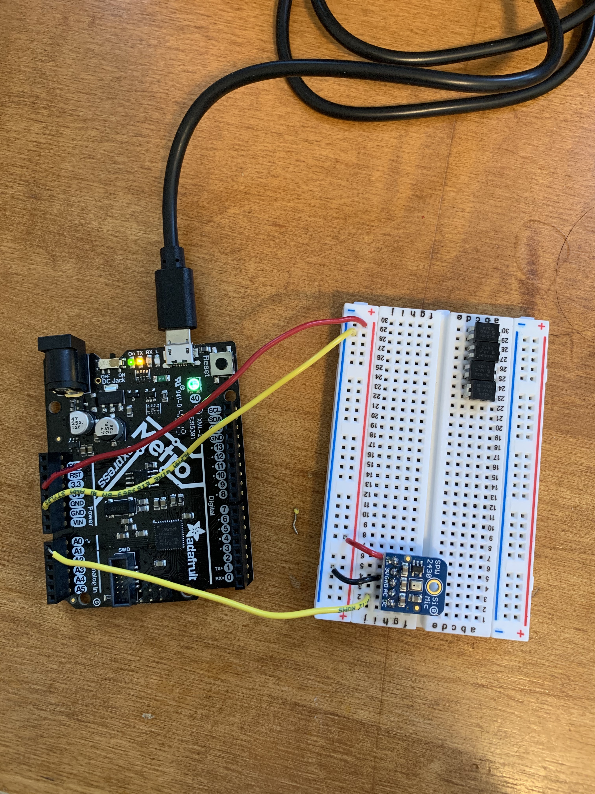

I've been inspired by everyone else's LED strip projects -- since I haven't worked with any LEDs yet, I decided this week to try out an LED strip as my output. Last week, I learned how to use the microphone -- why not combine the two? First, I set up the microphone just like I did last week.

My idea was to build an LED strip that visualizes music. When music is played, it would light up corresponding to the loudness of the music. The louder it was, the more LEDs would light up. Obviously this is not a new idea, many people had done this already. I Googled around a bit to see how others had connected the microphone with the LED strip and tried to copy their solutions. But in the end, none of those worked. I decided to build the microphone and LED components separately, get them to work, then combine the code myself.

First, I set up the microphone. Although I set it up just like last week, I had some issues with the microphone this time. The data was very noisy, and it didn't seem like it was able to pick up differences between when I was talking, when I was playing music, or silence. Sometimes I felt like it did, but I couldn't tell if it was just confirmation bias or whether the microphone is pretty inconsistent. 

I then built the LED part with just a plain LED instead of the whole LED strip. By tapping the microphone, you can see that the blue LED shows a response!

Next, I replaced the blue LED with the LED strip. This took more time than expected, I had to change around some pins and really understand what was going on before it worked.

After that, I uploaded the example code for the LED strip, which increments green lights through a for loop. Yay, this part worked!

Now, it got to the tricky part of combining microphone with the LED strip. Specifically, I needed to make sure that the microphone levels would translate into meaningful changes to the number of LED lights that displayed. At this point, I had two sketch files (one for the microphone, one for the LED strip), and I literally mish-mashed together. Then, I moved things around and just debugged. 

<!--  -->