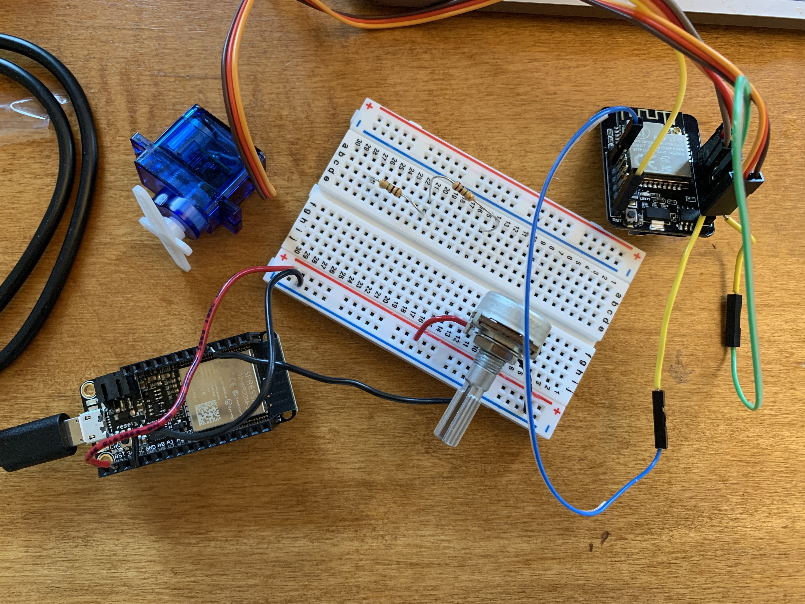
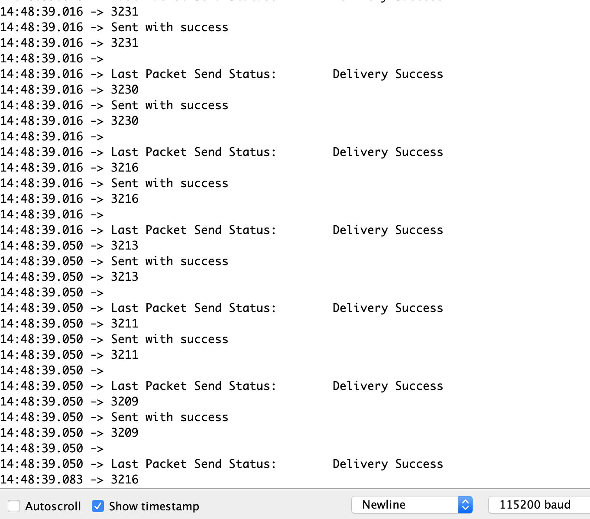

This week's content was so interesting!! So fascinating that we are able to converse with radio communication between two devices. 

I didn't have much time to work on this class this week, but I did manage to get the potentiometer and the servo motor working using Nathan's provided code. I had to review the earlier weeks to remember how to set up the potentiometer. Since it was my first time using a servo motor, I had to play around with the wires. There were a lot of wires going everywhere. 

Setting up the Huzzah as the sender and the ESP cam as the receiver was pretty buggy. Since I have to use a dongle in order to have a USB port, selecting the ports is very tricky. It took me too long to realize that I should have just uploaded code to one device at a time, instead of having both of them plugged at the same time. 

When finally uploaded correctly, the serial monitor is able to pick up on the values on the potentiometer, which translates to a certain degree for the servo motor. 

Interestingly, I found that not all values of the 0-4096 input of the potentiometer translated to movement of the servo motor. When a lower value was sent to the servo motor, it would make weird noises but show no movement. The only values that resulted to movement were around the mid-3000s to high-3000s range.

I unfortunately wasn't able to expand upon replicating Nathan's project, but after I turn in my thesis, I hope to change the output device to try out the LCD display or the piezo buzzer, neither of which I have used yet!
