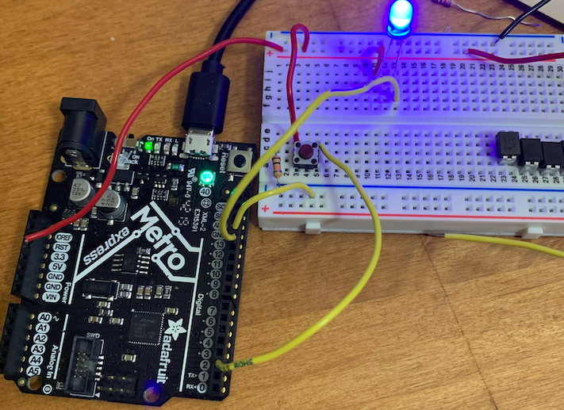
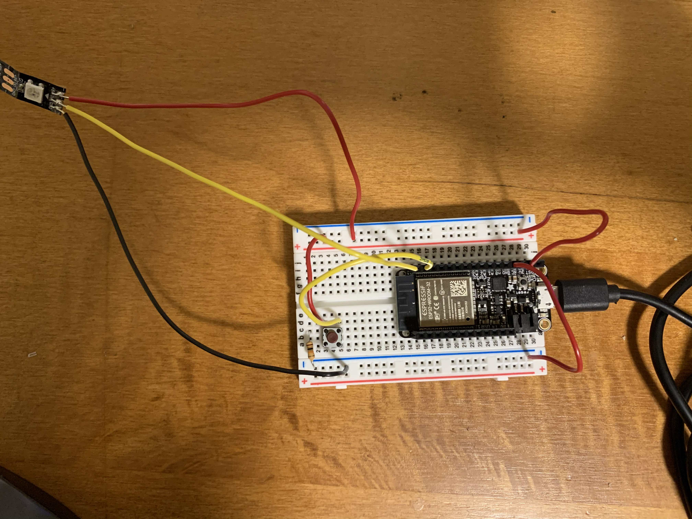
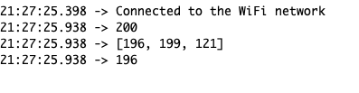

This week, I learned how to integrate Firebase in lab, turning on and off an LED. I think Firebase could have a lot of applications and uses for my final project when it comes to photos and storage. Generally, I think the Wifi unit will be really helpful. I hope to dive more into my final project next week. 

In terms of my weekly assignment, I asked my blockmates what they thought I should do for my project. My blockmates really liked the LED project I had done a few weeks ago, and wanted me to do something else with the LED strip. I settled on using a Random Number Generator API to randomly generate a RGB value for the LED strip upon the press of a button.

There's multiple random number generators, but I chose this one because of its simple [documentation](http://www.randomnumberapi.com/). It's just a simple GET request and it's super easy to get the values using a JSON object. 

The majority of my project was surprisingly spent on the coding aspect this week instead of the engineering part. Like I did with the LED strip project a couple weeks ago, I started out by testing out the button functionality with a simple LED instead of the strip. This was easy enough to implement, as seen in the photo below.

I spent a huge amount of time with the error "HTTPClient Library not found" or something like that, before realizing that I was using the wrong board! Instead of using the Huzzah, I was still using the Metro board. Thus, I switched over, although it got a little confusing which pins to use for the LED strip. In the end, Pin 17 was for the button and Pin 21 was for the LED strip. 

Integrating the code took some time. I debated a lot about whether to use delays and if so, where to use it. It was really exciting when I made my first API GET request and got some data in the serial monitor!

As you can see in the screenshot above, I indexed into the JSON object/array to retrieve each value. The idea was like the API call would return 3 random numbers between 0 and 256 (RGB values) and display that color on the LED strip. Asking for 3 random numbers between the values of 0 and 256 ends up in a API call that looks like this: 
"http://www.randomnumberapi.com/api/v1.0/random?min=0&max=256&count=3"

At this point, the LED strip did light up with different colors when I pressed the button, but there was some delay and sometimes I had to press the button multiple times before there was a response. 

I revisted my code and thought about how the delay functions were somehow slowing down the color changes. I realized that it was because I was calling 

    strip.show()

too late, which is the function call that shows the colors on the strip. With a few extra rounds of testing, it was complete!

In the future, I could improve on this by adding different patterns on the LED strip. Maybe I can generate more than 3 numbers to generate more than one color at a time. One application is that I could change this LED strip into a visual thermometer/weather monitor. I could easily integrate a weather API to return a temperature given a location and display it in colors!

P.S. I'm relying on GIFs because it seems like embedding videos on Markdown is not straightforward!

Here's my code: 

    #include <Adafruit_NeoPixel.h>
    #include <WiFi.h>
    #include <HTTPClient.h>
    #include <ArduinoJson.h>

    #define PIN        21 
    #define NUMPIXELS 10 
    #define DELAYVAL 50 // Time (in milliseconds) to pause between pixels
    #define WIFI_SSID "your_ssid"                                // input your home or public wifi name
    #define WIFI_PASSWORD "your_password"  

    const int sampleWindow = 50; // Sample window width in mS (50 mS = 20Hz)
        unsigned int sample;
    const int buttonPin = 17;     // the number of the pushbutton pin
    Adafruit_NeoPixel strip(NUMPIXELS, PIN, NEO_GRB + NEO_KHZ800);
    const String endpoint = "http://www.randomnumberapi.com/api/v1.0/random?min=0&max=256&count=3";

    // variables will change:
    int buttonState = 0;         // variable for reading the pushbutton status

    void setup() {
    Serial.begin(115200);
    WiFi.begin(WIFI_SSID, WIFI_PASSWORD);
    while (WiFi.status() != WL_CONNECTED) {
        delay(1000);
        Serial.println("Connecting to WiFi..");
    }
    Serial.println("Connected to the WiFi network");
    strip.begin(); // INITIALIZE NeoPixel strip object (REQUIRED)
    strip.show();            // Turn OFF all pixels ASAP
    strip.setBrightness(10); // Set BRIGHTNESS low to reduce draw (max = 255)
    }

    void loop() {
    if ((WiFi.status() == WL_CONNECTED)) { //Check the current connection status
            Serial.println("Press the button!");
            while (buttonState ==  LOW) {
                buttonState = digitalRead(buttonPin);
            }
            
            // check if the pushbutton is pressed. If it is, the buttonState is HIGH:
            if (buttonState == HIGH) {
                buttonState = LOW;
                Serial.println("You've pressed the button!");
                HTTPClient http;
                http.begin(endpoint); //Specify the URL
                int httpCode = http.GET();  //Make the request
            
                if (httpCode > 0) { //Check for the returning code
                    String payload = http.getString();
                    Serial.println(httpCode);
                    Serial.println(payload);
                    DynamicJsonDocument doc(10000); // Create a buffer of 10000 bytes
                    // Deserialize the JSON document
                    DeserializationError error = deserializeJson(doc, payload);
            
                    // Test if parsing succeeds.
                    if (error) {
                    Serial.print(F("deserializeJson() failed: "));
                    Serial.println(error.c_str());
                    return;
                    }
                Serial.println("interesting, nice color choice");
                strip.fill(strip.Color(doc[0], doc[1], doc[2]), 0, 10);
                strip.show();
                http.end(); //Free the resources
                delay(1000);
            } else {
                strip.fill(strip.Color(0, 0, 0), 0);
                strip.show();
            } 
        }
        else {
        Serial.println("Did you press the button?");
        delay(1000);
        }
    } 
    }